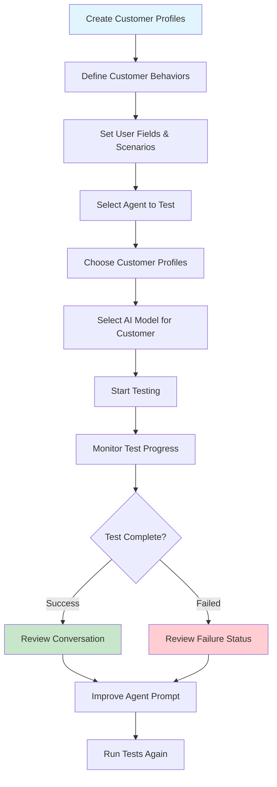
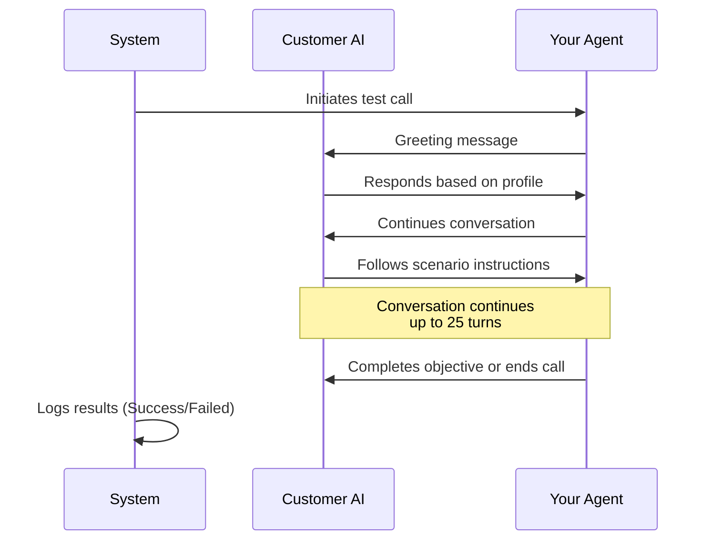
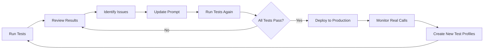

<Info>
  **What you'll learn:** How to create customer profiles, run automated tests on your AI agents, and interpret test results to improve performance.
</Info>

## What Is Automated Agent Testing?

Automated agent testing allows you to **simulate real customer interactions** without making actual phone calls. Think of it as a rehearsal where your AI agent practices with different types of customers before going live.

Instead of manually calling test numbers, you create **Customer Profiles** that act like different customers, and the system automatically tests how well your agent handles each scenario.

## Why Use Automated Testing? 🎯

### **The Problems It Solves:**
- **Time-consuming manual testing** - No need to manually test every scenario
- **Inconsistent test coverage** - Ensures all scenarios are tested systematically
- **Costly errors in production** - Catch issues before real customers are affected
- **Difficult to reproduce edge cases** - Create specific scenarios that are hard to test manually

### **The Benefits:**
- **Fast iteration** - Test multiple scenarios simultaneously
- **Cost-effective** - Only $0.02 per customer profile test
- **Consistent results** - Same scenarios tested the same way every time
- **Comprehensive coverage** - Test edge cases that rarely happen in real life

## How Automated Testing Works 🔧

The testing flow is simple:



## Step 1: Create Customer Profiles

Customer Profiles are **simulated customers** that interact with your AI agent. Each profile represents a different type of customer with unique behaviors, responses, and scenarios.

### **Accessing the Customer Profile Page**

1. Navigate to: [https://app.vodex.ai/account/test-customer](https://app.vodex.ai/account/test-customer)
2. Click the **"Add New Customer"** button
3. You'll see a form with several fields to configure

### **Customer Profile Fields**

Here's what each field means and how to fill it out:

<Tabs>
  <Tab title="Customer Name">
    ### Customer Name
    
    **What it is:** A unique identifier for this customer profile.
    
    **Purpose:** Helps you quickly identify which customer scenario you're testing.
    
    **Examples:**
    - "Sarah - Interested Buyer"
    - "John - Difficult Customer"
    - "Maria - Payment Ready"
    - "David - Needs More Info"
    
    <Tip>
      Use descriptive names that instantly tell you what type of customer this profile represents.
    </Tip>
  </Tab>
  
  <Tab title="Short Description">
    ### Short Description
    
    **What it is:** A brief summary of the customer's behavior and scenario.
    
    **Purpose:** Quick reference to understand what this profile tests.
    
    **Examples:**
    - "Loan clear today, agree RPC"
    - "Customer wants to reschedule appointment"
    - "Payment declined, needs alternative method"
    - "Interested but has budget concerns"
    
    <Check>
      Keep it under 100 characters for easy scanning in your test dashboard.
    </Check>
  </Tab>
  
  <Tab title="Customer Scenario">
    ### Customer Scenario
    
    **What it is:** A detailed description of who the customer is, their situation, and how they should behave.
    
    **Purpose:** Teaches the AI model how to impersonate this customer realistically.
    
    **What to include:**
    - Customer's background and situation
    - Their goals or concerns
    - How they should respond to agent questions
    - Their personality traits (friendly, skeptical, busy, etc.)
    - Any specific objections they should raise
    
    **Example 1 - Payment Collection:**
    ```
    You are Michael Thompson, a 35-year-old business owner who has an overdue 
    invoice of $500 from 30 days ago. You've been busy with your business and 
    forgot about the payment. When the AI agent calls, you should:
    
    - Be apologetic about the missed payment
    - Confirm you received the invoice
    - Express willingness to pay immediately
    - Ask if you can pay by credit card
    - If asked about amount, confirm it's $500
    - Thank the agent for the reminder
    ```
    
    **Example 2 - Difficult Customer:**
    ```
    You are Lisa Chen, a 42-year-old professional who is very busy and 
    skeptical of sales calls. You have a loan but you're frustrated because:
    
    - You believe you already made a payment
    - You're in a meeting and don't have time for a long call
    - You want written confirmation before discussing anything
    - You should be polite but firm
    - If the agent is respectful and brief, you'll engage
    - If the agent is pushy, you'll end the call
    ```
    
    **Example 3 - Appointment Booking:**
    ```
    You are Robert James, a 28-year-old who's interested in a consultation 
    but has specific scheduling needs. When the AI agent calls, you should:
    
    - Express interest in the service
    - Say you're only available on Thursdays after 3 PM
    - Ask how long the appointment will take
    - Request a reminder text message
    - Confirm your phone number and email
    - Thank the agent and express excitement
    ```
  </Tab>
  
  <Tab title="User Fields">
    ### User Fields
    
    **What it is:** Key-value pairs that provide specific data about the customer.
    
    **Purpose:** Allows your agent to access customer-specific information during the call.
    
    **Common Fields:**
    
    | Field Name | Example Value | When to Use |
    |------------|---------------|-------------|
    | `Amount` | `500.00` | Payment collection calls |
    | `Merchant` | `ABC Store` | Purchase-related conversations |
    | `DueDate` | `2025-11-30` | Payment reminders |
    | `AppointmentDate` | `2025-12-01` | Appointment confirmations |
    | `LoanID` | `LN-12345` | Loan-related calls |
    | `CustomerID` | `CUST-789` | General customer identification |
    | `today` | `NA` | When using time-sensitive prompts |
    | `time_zone` | `America/New_York` | For time zone calculations |
    
    **Example Configuration:**
    ```json
    {
      "Amount": "1250.00",
      "Merchant": "Tech Solutions Inc",
      "DueDate": "2025-11-20",
      "CustomerID": "CUST-4567",
      "today": "NA",
      "time_zone": "America/Los_Angeles"
    }
    ```
    
    <Warning>
      **Special Fields to Note:**
      - If your prompt contains **"today"** or references to the current date, you MUST add a `today` field with value `"NA"`
      - For **"time_zone"**, use standard timezone names like `"America/New_York"`, `"Europe/London"`, etc.
    </Warning>
  </Tab>
</Tabs>

### **Complete Customer Profile Example**

Here's a fully filled out customer profile for reference:

<Accordion title="View Complete Example">

**Customer Name:** Sarah - Ready to Pay

**Short Description:** Customer acknowledges debt and wants to clear it today

**Customer Scenario:**
```
You are Sarah Martinez, a 31-year-old teacher who has an outstanding balance 
of $850 with LoanCo. You received several reminder emails but have been dealing 
with family issues and forgot to pay. 

When the AI agent calls:
- Apologize for the delay and explain you've been dealing with personal matters
- Confirm you remember the loan
- Express that you want to clear it today
- Ask if you can pay by credit card over the phone
- Confirm the amount is $850
- Ask for a confirmation email after payment
- Thank the agent for being understanding
- Be friendly and cooperative throughout

If asked about your availability: You're available now and want to complete 
the payment immediately.

If asked about payment method: Prefer credit card, but can do bank transfer 
if needed.
```

**User Fields:**
```json
{
  "Amount": "850.00",
  "LoanID": "LN-98765",
  "DueDate": "2025-11-15",
  "CustomerID": "CUST-2345",
  "CustomerName": "Sarah Martinez",
  "today": "NA",
  "time_zone": "America/Chicago"
}
```

</Accordion>

### **Creating Multiple Customer Profiles**

For comprehensive testing, create profiles that cover:

<Check>
  **Essential Test Scenarios:**
  - ✅ **Happy Path** - Cooperative customer who completes the objective
  - ✅ **Objection Handler** - Customer with concerns or questions
  - ✅ **Difficult Customer** - Skeptical or resistant customer
  - ✅ **Busy Customer** - Person who has limited time
  - ✅ **Confused Customer** - Doesn't understand or needs clarification
  - ✅ **Edge Case** - Unusual situations or unexpected responses
</Check>

## Step 2: Test Your AI Agent

Once you've created customer profiles, it's time to test your AI agent against them.

### **Starting a Test**

1. **Navigate to Your Agent:**
   - Go to the **Agents** section in your dashboard
   - Find the AI agent you want to test

2. **Access Test Options:**
   - Click the **three dots (⋮)** next to your agent's name
   - Select **"Test Agent"** from the dropdown menu

3. **Configure the Test:**
   
   You'll see a test configuration screen with these options:

<Tabs>
  <Tab title="Select Customer Profiles">
    ### Choose Customer Profiles
    
    **What to do:** Select one or more customer profiles you created in Step 1.
    
    **Options:**
    - **Single profile** - Test one specific scenario
    - **Multiple profiles** - Test several scenarios in batch
    
    **Best Practice:**
    ```
    Start with 3-5 profiles that cover:
    1. Your ideal customer (happy path)
    2. A common objection scenario
    3. A difficult customer scenario
    ```
    
    <Tip>
      You can run multiple profiles simultaneously to speed up testing.
    </Tip>
  </Tab>
  
  <Tab title="Select AI Model">
    ### Choose the Customer Model
    
    **What it is:** The AI model that will impersonate your test customers.
    
    **Purpose:** Different models have different conversation styles and capabilities.
    
    <Info>
      **View All Available Models:** Check out our [Call Settings Overview](/call-settings/overview#ai-model-selection) for a complete list of available AI models, their capabilities, and recommendations for different use cases.
    </Info>
    
    **Quick Recommendations:**
    - **Complex scenarios**: Use advanced models like GPT-4 or Claude Sonnet
    - **Simple scenarios**: Use efficient models like GPT-3.5 or Claude Haiku
    - **Natural conversations**: Claude models excel at human-like dialogue
    
    <Tip>
      Most users should start with **GPT-4** or **Claude Sonnet** for comprehensive testing.
    </Tip>
  </Tab>
</Tabs>

4. **Start Testing:**
   - After selecting profiles and model, click **"Start Testing"**
   - The system will begin running automated conversations
   - Each profile will interact with your agent independently

### **What Happens During Testing?**



    <Info>
      **Test Duration:** Each test conversation runs automatically and completes within 1-3 minutes depending on complexity. Each test costs $0.02 per customer profile.
    </Info>

## Step 3: View Test Results

After testing completes, you can review the results and identify areas for improvement.

### **Accessing Test Results**

1. **Return to Your Agent:**
   - Go back to the **Agents** section
   - Find the same AI agent you tested

2. **Open Test Progress:**
   - Click the **three dots (⋮)** next to the agent
   - Select **"Test Agent Progress"**

3. **Review Results Dashboard:**
   - You'll see a list of all test runs with their status

### **Understanding Test Status**

<Tabs>
  <Tab title="Success ✅">
    ### Success Status
    
    **What it means:** The conversation completed gracefully without errors.
    
    **Success indicators:**
    - Agent followed the prompt correctly
    - All custom fields were accessible
    - Conversation reached a natural conclusion
    - No system errors occurred
    
    **What to check:**
    - Read the conversation transcript
    - Verify the agent achieved its objective
    - Check if the tone and responses were appropriate
    - Confirm all tags (like `(disconnect)`) worked correctly
    
    **Even if marked "Success", you should review:**
    - Did the agent sound natural?
    - Was the conversation efficient?
    - Could anything be improved?
    
    <Check>
      A "Success" status means technical success - still review for quality!
    </Check>
  </Tab>
  
  <Tab title="Failed ❌">
    ### Failed Status
    
    **What it means:** Something went wrong during the conversation.
    
    **Common reasons for failure:**
    
    1. **Custom Field Issues**
       - Missing required custom fields
       - Incorrect field names (case-sensitive)
       - Invalid field values
       
    2. **System Errors**
       - Connection timeout
       - API rate limits exceeded
       - Model unavailable
       
    3. **Configuration Problems**
       - Incomplete prompt setup
       - Missing agent configuration
       - Invalid tags in prompt
    
    **How to troubleshoot:**
    
    ```
    Step 1: Check the error message in the test results
    Step 2: Verify all custom fields are correctly configured
    Step 3: Review your agent prompt for syntax errors
    Step 4: Ensure all required fields have values
    Step 5: Re-run the test after fixes
    ```
    
    <Warning>
      **Most common cause:** Missing or incorrectly named custom fields in your prompt vs. customer profile.
    </Warning>
  </Tab>
  
  <Tab title="Turn Limit">
    ### 25-Turn Conversation Limit
    
    **What it is:** Every test conversation is limited to 25 turns (back-and-forth exchanges).
    
    **Why it exists:** Prevents infinite loops and ensures efficient conversations.
    
    **What counts as a turn:**
    - 1 turn = Agent speaks, then customer responds
    - 25 turns = approximately 10-15 minutes of conversation
    
    **If you hit the limit:**
    
    | Situation | What It Means | What To Do |
    |-----------|---------------|------------|
    | **Agent accomplishes goal before 25 turns** | ✅ Perfect | No action needed |
    | **Conversation naturally ends before 25 turns** | ✅ Good | Consider if it could be shorter |
    | **Hits 25 turns without completing** | ⚠️ Issue | Simplify your prompt or objective |
    | **Repetitive conversation** | ❌ Problem | Fix conversation loop in prompt |
    
    <Danger>
      **Red Flag:** If you consistently hit the 25-turn limit, your prompt may be too complex or contain logic loops.
    </Danger>
  </Tab>
</Tabs>

### **Analyzing Conversation Transcripts**

When reviewing test results, look for these key elements:

<Accordion title="Conversation Quality Checklist">

#### ✅ **Natural Flow**
- [ ] Agent sounds conversational, not robotic
- [ ] Smooth transitions between topics
- [ ] Appropriate pauses and acknowledgments
- [ ] Natural response to customer questions

#### ✅ **Objective Achievement**
- [ ] Agent stayed focused on the goal
- [ ] Successfully completed the intended action
- [ ] Didn't get sidetracked by irrelevant topics
- [ ] Used appropriate closing statements

#### ✅ **Objection Handling**
- [ ] Acknowledged customer concerns
- [ ] Provided helpful responses
- [ ] Didn't sound defensive or pushy
- [ ] Offered alternatives when appropriate

#### ✅ **Technical Correctness**
- [ ] All custom fields displayed correctly
- [ ] Tags triggered appropriate actions
- [ ] No error messages in conversation
- [ ] Transfers and disconnects worked properly

#### ✅ **Professional Tone**
- [ ] Maintained consistent personality
- [ ] Used appropriate language
- [ ] Showed empathy when needed
- [ ] Ended conversation gracefully

</Accordion>

## Testing Costs and Billing 💰

Automated testing is extremely cost-effective:

<Info>
  **Pricing Structure:**
  - **Cost per test:** $0.02 per customer profile test
  - **Pay as you go:** Only pay for the tests you run
  - **Billing cycle:** All charges accumulate throughout the day and are deducted at the end of the day
  - **No subscription fees:** No daily or monthly charges - only pay when you test
</Info>

### **Cost Examples**

| Testing Activity | Number of Tests | Cost |
|------------------|-----------------|------|
| Run 5 customer profile tests | 5 | $0.10 |
| Run 10 customer profile tests | 10 | $0.20 |
| Run 50 customer profile tests | 50 | $1.00 |
| Run 100 customer profile tests | 100 | $2.00 |
| No testing | 0 | $0.00 |

**Example Billing Cycle:**
```
Monday:
  - 9:00 AM: Test Agent with 3 profiles = $0.06
  - 2:00 PM: Test Agent with 5 profiles = $0.10
  - 5:00 PM: Test Agent with 2 profiles = $0.04
  
  Total deducted at end of Monday: $0.20
```

<Check>
  **Value Proposition:** At just 2 cents per test, you can thoroughly validate your agents before deploying them to real customers, ensuring quality and reducing costly mistakes.
</Check>

## Best Practices for Automated Testing

### **1. Create a Comprehensive Test Suite**

Build a library of customer profiles that cover all scenarios:

```
Essential Profiles to Create:
├── Happy Path
│   ├── Eager customer
│   └── Cooperative customer
├── Common Objections
│   ├── Price concerns
│   ├── Timing issues
│   └── Need more information
├── Difficult Scenarios
│   ├── Angry customer
│   ├── Skeptical customer
│   └── Very busy customer
└── Edge Cases
    ├── Language barriers
    ├── Hearing difficulties
    └── Unexpected situations
```

### **2. Test Before Every Major Change**

Run your test suite whenever you:
- ✅ Update your agent prompt
- ✅ Add new custom fields
- ✅ Change call flow logic
- ✅ Modify greeting or voicemail messages
- ✅ Update objection handling strategies

### **3. Iterate Based on Results**

Use this continuous improvement cycle:



### **4. Document Your Test Scenarios**

Keep a record of:
- What each customer profile tests
- Expected outcomes for each profile
- Changes made based on test results
- Performance improvements over time

### **5. Test with Realistic Data**

<Warning>
  **Important:** Use realistic but not actual customer data in your test profiles. Create fictional but plausible scenarios that mirror real situations.
</Warning>

## Troubleshooting Common Issues

### **Issue 1: Test Shows Success but Conversation Quality is Poor**

**Problem:** Test passes technically but the conversation doesn't sound good.

**Solution:**
1. Read the full transcript carefully
2. Identify specific lines that sound unnatural
3. Update your prompt with better instructions
4. Add more example responses to guide the agent
5. Test again with the same profile

---

### **Issue 2: Tests Keep Failing with Custom Field Errors**

**Problem:** Agent can't access custom fields in the conversation.

**Solution:**
1. Check field names are **exactly the same** in:
   - Your agent prompt
   - Your customer profile
2. Field names are **case-sensitive** (`Amount` ≠ `amount`)
3. Ensure all fields referenced in your prompt exist in the customer profile
4. Verify field values are in the correct format

**Example Fix:**

❌ **In Prompt:** `The amount due is {total_amount}`  
❌ **In Profile:** `"Amount": "500"`  
✅ **Fixed:** Both use `"total_amount"` or both use `"Amount"`

---

### **Issue 3: Hitting the 25-Turn Limit Regularly**

**Problem:** Conversations are too long and hit the maximum turn limit.

**Solution:**
1. Simplify your agent's objectives
2. Remove unnecessary questions from the prompt
3. Add clearer exit criteria to end calls sooner
4. Check for conversation loops (agent repeating same questions)
5. Use tags like `(disconnect)` more strategically

---

### **Issue 4: Customer AI Doesn't Follow the Scenario**

**Problem:** The AI impersonating the customer doesn't behave as described in the profile.

**Solution:**
1. Make the customer scenario more specific and detailed
2. Use clear imperative language ("You should...", "Always...", "Never...")
3. Provide example responses in the scenario
4. Test with a more advanced AI model (GPT-4 or Claude)
5. Break complex scenarios into simpler ones

---

### **Issue 5: Tests Pass But Real Calls Fail**

**Problem:** Automated tests work but real customer calls have issues.

**Solution:**
1. Create more realistic customer profiles
2. Add profiles for unexpected customer behaviors
3. Include interruptions and side questions in scenarios
4. Test with more varied customer personalities
5. Review real call recordings and create profiles that match

## Advanced Testing Strategies

### **Regression Testing**

Create a **baseline test suite** that you run before every deployment:

```
Baseline Test Suite:
1. Happy path customer (should always pass)
2. Common objection (tests objection handling)
3. Difficult customer (tests resilience)
4. Quick call (tests efficiency)
5. Complex scenario (tests advanced logic)
```

### **A/B Testing Your Prompts**

Test different versions of your agent:

1. Create Agent Version A with one prompt approach
2. Create Agent Version B with a different prompt approach
3. Run the same customer profiles against both
4. Compare results to see which performs better
5. Deploy the winning version

### **Stress Testing**

Test extreme scenarios:
- Very long customer responses
- Customer who constantly interrupts
- Customer who goes completely off-topic
- Customer who is extremely emotional
- Multiple objections in one call

### **Progressive Testing**

Start simple and increase complexity:

```
Week 1: Test basic scenarios (happy path)
Week 2: Add common objections
Week 3: Add difficult customers
Week 4: Add edge cases
Week 5: Add stress tests
```

## Success Metrics

Track these metrics to measure testing effectiveness:

| Metric | How to Calculate | Target |
|--------|------------------|--------|
| **Test Pass Rate** | (Successful tests / Total tests) × 100 | >90% |
| **Average Turns** | Total turns / Number of tests | \<15 turns |
| **Scenario Coverage** | Number of scenarios tested | All critical paths |
| **Issues Found** | Problems identified before production | Track trend |
| **Time to Fix** | Time from issue found to resolved | \<1 day |

## Next Steps

Now that you understand automated testing:

1. **Start small** - Create 3-5 customer profiles for your most common scenarios
2. **Run your first test** - Test your agent with these profiles
3. **Review results** - Carefully read the transcripts and identify improvements
4. **Iterate** - Update your prompt based on findings
5. **Expand coverage** - Gradually add more profiles for edge cases
6. **Make it routine** - Run tests before every significant change

<Check>
  **Ready to start testing?** Head to [https://app.vodex.ai/account/test-customer](https://app.vodex.ai/account/test-customer) and create your first customer profile today!
</Check>

---

## Related Resources

**Want to improve your agent's responses?** Check out our [Prompt Guide](/agents/prompt) to learn how to write more effective instructions.

**Need to add automated actions?** Visit our [Tags Guide](/agents/tags) to learn about special commands like `(disconnect)` and `(transfer)`.

**Just getting started?** Read our [Agents Overview](/agents/overview) to understand the basics of AI agent creation.

