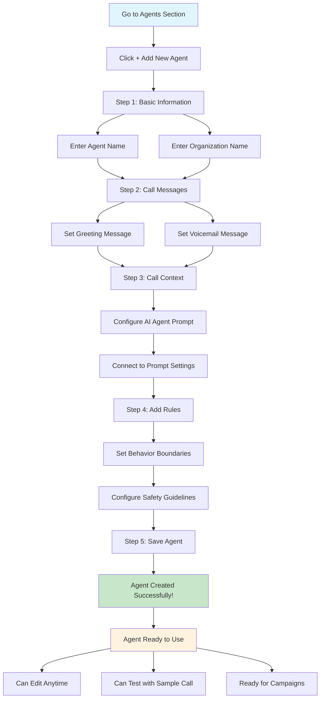

<Info>
  **What you'll learn:** How to create AI agents that can make phone calls, what information you need to provide, and how to set them up step by step.
</Info>

## What Are AI Agents?

Think of an AI agent as a **virtual employee** that can make phone calls for you. Just like a real person, it needs:
- A name to identify itself
- Instructions on what to say
- Rules to follow during conversations
- The ability to handle different situations

## How to Create Your First AI Agent

Creating an AI agent is like filling out a form - you provide information, and the system builds your virtual caller. Here's how it works:

## Visual Guide: Agent Creation Process

Here's a simple flowchart showing the complete agent creation process:

### **Step 1: Start Creating Your Agent**

1. Go to the **Agents section** in your dashboard
2. Click the **"Add New Agent"** button
3. You'll see a form with several sections to fill out

### **Step 2: Basic Agent Information**

This is where you give your agent its identity:

| Field | What to Enter | Example |
|-------|---------------|---------|
| **Agent Name** | What you want to call your agent | "Sarah from Customer Service" |
| **Organization Name** | Your company or business name | "ABC Corporation" |

<Warning>
  **Important:** Choose a clear, professional name for your agent. This is what callers will hear when they answer the phone.
</Warning>

### **Step 3: Call Messages**

These are the messages your agent will say in different situations:

#### **Greeting Message**
- **What it is:** The first thing your agent says when someone answers the phone
- **When it's used:** Every time someone picks up the call
- **Example:** "Hello, this is Sarah from ABC Corporation. I'm calling about your recent order."

#### **Voicemail Message**
- **What it is:** What your agent says when the call goes to voicemail
- **When it's used:** When no one answers and the call goes to voicemail
- **Example:** "Hi, this is Sarah from ABC Corporation. Please call me back at 555-123-4567 when you have a moment."

<Info>
  **Pro Tip:** Keep your messages clear, friendly, and professional. People are more likely to respond positively to a well-crafted message.
</Info>

### **Step 4: Call Context (The Brain)**

This is where you give your agent its **intelligence** - what it knows and how it should behave:

1. **Click "Next"** after filling out the basic information
2. **You'll see the Call Context section**
3. **This connects to your [Prompt](/agents/prompt) settings** - click on "prompt" to go to that page
4. **The prompt contains all the instructions** your agent needs to have natural conversations

Think of the prompt as a **script and rulebook** that tells your agent:
- How to introduce itself
- What questions to ask
- How to handle different responses
- When to transfer calls
- How to end conversations

<Check>
  **Key Point:** The prompt is the most important part of your agent. It determines how smart and effective your agent will be in conversations.
</Check>

### **Step 5: Add Rules (The Boundaries)**

After setting up the call context, you'll move to the **Rules section**:

1. **Click "Next"** to proceed from Call Context
2. **You'll see the Add Rules section**
3. **Rules help control your agent's behavior** and set limits

Rules are like **safety guidelines** that prevent your agent from:
- Going off-topic
- Making inappropriate statements
- Spending too long on calls
- Violating company policies

## What Happens After You Create an Agent?

Once you've completed all the steps:

1. **Click Save** then it is ready to use
2. **You can test it** with a sample call
3. **You can edit it** anytime to make improvements
4. **You can use it** in campaigns or individual calls

## Common Questions About Agents

### **How Many Agents Can I Create?**
- You can create as many agents as you need
- Each agent can have different personalities and purposes
- You might have one for sales, another for customer service, etc.

### **Can I Change My Agent Later?**
- **Yes!** You can edit your agent anytime
- Change the name, messages, or rules
- Update the prompt to improve performance
- Test different versions to see what works best

### **What Makes a Good Agent?**
- **Clear purpose** - Knows exactly what it's calling about
- **Professional tone** - Sounds trustworthy and helpful
- **Good instructions** - Has a well-written prompt
- **Appropriate rules** - Stays within boundaries
- **Natural conversation** - Doesn't sound robotic

## Best Practices for Creating Agents

### **1. Start Simple**
- Begin with basic information
- Add complexity gradually
- Test before adding advanced features

### **2. Be Specific**
- Give your agent a clear role
- Write specific, actionable instructions
- Set realistic expectations

### **3. Test and Improve**
- Always test your agent before using it
- Listen to call recordings
- Make adjustments based on results
- Ask for feedback from your team

### **4. Keep It Professional**
- Use appropriate language
- Avoid slang or jargon
- Maintain a consistent tone
- Follow your company's voice

## Next Steps

Now that you understand how to create agents:

1. **Go to the Agents section** and click "Add New Agent"
2. **Fill out the basic information** (name, organization, messages)
3. **Set up the call context** by configuring your [prompt](/agents/prompt)
4. **Add appropriate rules** to keep your agent on track
5. **Test your agent** to make sure it works correctly

<Check>
  **Ready to create your first AI agent?** Follow these steps to build a professional, effective virtual caller that represents your business perfectly.
</Check>

---

**Need help with prompts?** Check out our [Prompt Guide](/agents/prompt) to learn how to write effective instructions for your AI agents.

**Want to learn about tags?** Visit our [Tags Guide](/agents/tags) to understand how to add special commands to your prompts.
