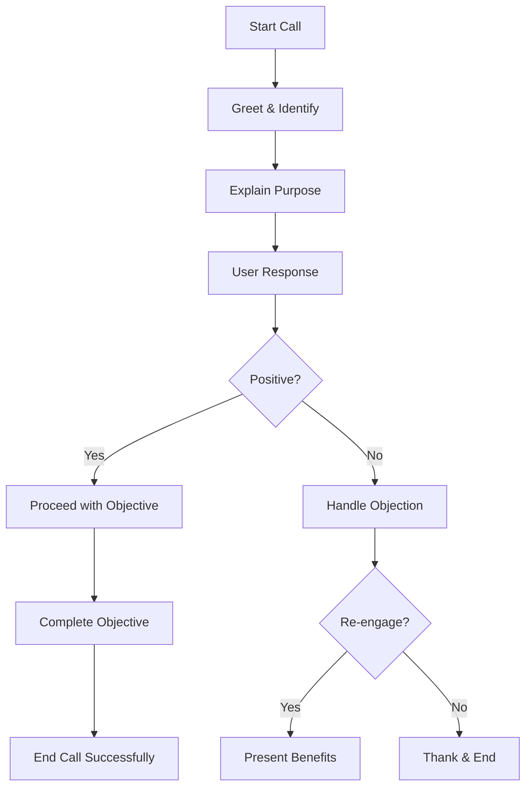

# Creating Effective AI Call Prompts

<Info>
  **What you'll learn:** How to design AI call prompts that sound natural, handle objections gracefully, and achieve your business objectives.
</Info>

## Overview

Creating an effective AI call prompt is like writing a detailed instruction manual for your AI agent. The goal is to design a clear, structured set of instructions that teach the bot how to sound natural, handle different scenarios, and achieve the purpose of the call.

## Key Components of a Great Prompt

### 1. **Define Your Objective** 🎯

Before writing anything, clearly identify what you want the AI to accomplish:

- **Lead Qualification** - Determine if prospects meet your criteria
- **Appointment Booking** - Schedule meetings or consultations
- **Payment Collection** - Process payments or collect outstanding balances
- **Customer Updates** - Provide status updates or information
- **Survey Collection** - Gather feedback or data

<Warning>
  **Pro tip:** Every part of your prompt should align with your primary objective. Don't mix multiple goals in a single prompt.
</Warning>

### 2. **Set the AI Personality** 👤

Define how your AI should behave during conversations:

| Personality Type | Tone | Best For | Example Use Case |
|------------------|------|-----------|------------------|
| **Warm & Persuasive** | Friendly, encouraging | Sales calls, lead generation | Converting prospects to customers |
| **Professional & Neutral** | Formal, informative | B2B communications | Technical support, corporate updates |
| **Empathetic & Helpful** | Caring, supportive | Customer service | Resolving issues, providing assistance |

**What to Include:**
- Tone and style guidelines
- Language preferences (formal vs. casual)
- What to avoid (robotic responses, overly casual language)

**Example Personality Setting:**
```markdown
The AI should sound warm and professional, like a helpful customer service representative. 
Use a friendly tone but maintain professionalism. Avoid sounding robotic or overly casual.
Always be empathetic to the customer's needs and concerns.
```

### 3. **Design the Conversation Flow** 🔄

Unlike static scripts, AI prompts should be dynamic and teach the bot how to respond naturally:

#### Basic Flow Structure



#### Step-by-Step Instructions

Write instructions in the third person as if guiding someone step by step:

```markdown
1. After confirming the user's identity, greet them warmly using their name
2. Explain the purpose of the call clearly and concisely
3. Ask if they are open to continuing the conversation
4. If they respond positively, proceed with qualifying questions
5. If they respond negatively, acknowledge their time and ask if there's a better time
6. If they still decline, thank them politely and end the call
```

### 4. **Handle Objections Gracefully** 🛡️

Prepare structured responses for common pushbacks:

<Accordion title="Common Objections & Responses">

#### "I'm not interested right now"

**Response Strategy:**
- Acknowledge their time and current situation
- Offer to call back at a better time
- Provide a soft benefit or alternative

**Example Response:**
```
"I completely understand you're busy right now. Would it be better if I called you back 
tomorrow afternoon? Or perhaps you'd prefer to receive our information via email instead?"
```

#### "I need to think about it"

**Response Strategy:**
- Respect their decision-making process
- Offer additional information or resources
- Set a follow-up timeline

**Example Response:**
```
"Of course, this is an important decision. I'd be happy to send you some additional 
information to help with your decision. When would be a good time to follow up with you?"
```

#### "I'm not the right person"

**Response Strategy:**
- Thank them for their time
- Ask for the correct contact person
- Request permission to transfer the call

**Example Response:**
```
"Thank you for letting me know. Could you please direct me to the person who handles 
[relevant topic]? Or would you prefer to take a message and have them call me back?"
```

</Accordion>

### 5. **Plan for Every Outcome** 📋

Anticipate all possible responses and ensure the AI knows how to handle them:

<Check>
  **Complete Coverage:** A well-structured prompt should cover positive, negative, and neutral responses with clear next steps for each.
</Check>

#### Response Categories

| Response Type | AI Action | Example |
|---------------|-----------|---------|
| **Positive** | Proceed with objective | "Great! Let me ask you a few questions..." |
| **Negative** | Handle objection or end gracefully | "I understand. Thank you for your time." |
| **Neutral** | Gather more information | "Could you tell me more about that?" |
| **Confused** | Clarify and simplify | "Let me explain this in a different way..." |

## Best Practices

### ✅ **Do's**

- **Keep it simple** - Use clear, straightforward language
- **Test thoroughly** - Run multiple scenarios to catch edge cases
- **Update regularly** - Refine based on real-world performance
- **Include examples** - Provide sample responses for common situations
- **Set clear boundaries** - Define what the AI should and shouldn't do

### ❌ **Don'ts**

- **Overcomplicate** - Don't create overly complex branching logic
- **Forget edge cases** - Always plan for unexpected responses
- **Ignore tone** - Don't let the AI sound robotic or unprofessional
- **Mix objectives** - Don't try to accomplish multiple goals in one prompt
- **Skip testing** - Always validate your prompt before deployment

## Template Structure

Here's a complete template you can use as a starting point:

```markdown
# AI Call Prompt Template

## Objective
[Clearly state what the AI should accomplish]

## Personality
[Define tone, style, and behavior guidelines]

## Conversation Flow
1. [Step-by-step instructions]
2. [Include branching logic]
3. [Handle different responses]

## Objection Handling
- [Common objection 1]: [Response strategy]
- [Common objection 2]: [Response strategy]

## Success Criteria
[Define what constitutes a successful call]

## End Call Instructions
[How to properly conclude the conversation]
```

## Testing Your Prompt

Before deploying, test your prompt with these scenarios:

<Accordion title="Test Scenarios">

### **Happy Path Testing**
- User is interested and engaged
- User has all necessary information
- Call proceeds smoothly to completion

### **Objection Testing**
- User raises common objections
- User seems hesitant or unsure
- User is in a hurry or distracted

### **Edge Case Testing**
- User speaks a different language
- User has hearing difficulties
- User is in a noisy environment
- User needs to put you on hold

### **End-of-Call Testing**
- User agrees to next steps
- User declines further contact
- User requests follow-up information

</Accordion>

## Common Mistakes to Avoid

<Danger>
  **Watch out for these common pitfalls that can make your AI sound robotic or ineffective.**
</Danger>

1. **Too Many Rules** - Overly complex prompts confuse the AI
2. **Missing Context** - AI doesn't understand the business context
3. **Poor Objection Handling** - AI gets stuck when users push back
4. **Inconsistent Tone** - AI switches between different personalities
5. **No Fallback Plans** - AI doesn't know what to do in unexpected situations

## Success Metrics

Track these metrics to measure your prompt's effectiveness:

| Metric | What It Measures | Target |
|--------|------------------|---------|
| **Completion Rate** | Percentage of calls that achieve their objective | >80% |
| **Objection Handling** | Success rate of overcoming common objections | >70% |
| **User Satisfaction** | Customer feedback on call quality | >4.5/5 |
| **Call Duration** | Average length of successful calls | Optimize for efficiency |

## Next Steps

Now that you understand the fundamentals of creating effective AI call prompts:

1. **Start with a simple objective** - Don't try to do everything at once
2. **Use the template** - Follow the structure provided above
3. **Test thoroughly** - Run multiple scenarios before deployment
4. **Iterate and improve** - Refine based on real-world performance
5. **Document your learnings** - Keep track of what works and what doesn't

<Tip>
  **Ready to create your first prompt?** Start with the template above and customize it for your specific use case. Remember, the key is to be clear, comprehensive, and always think about the user's perspective.
</Tip>

---

**Need help?** Check out our [Tags documentation](/agents/tags) to learn how to organize and categorize your prompts effectively.
