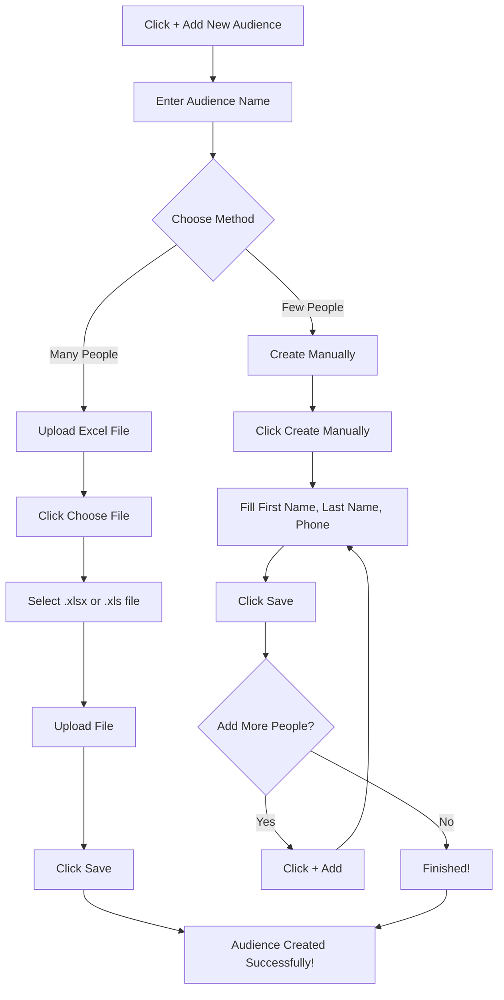

<Info>
  **What you'll learn:** How to add people to your calling list (audience) so your AI agents know who to call. This guide covers both manual entry and file upload methods.
</Info>

## What Is an Audience?

Think of an **audience** as your **calling list** - the people you want your AI agents to call. Just like you need a phone book to make calls, your AI agents need an audience list to know who to contact.

## Why Do You Need an Audience?

- **Your AI agents need targets** - They can't call people if they don't know who to call
- **Organize your contacts** - Group people by different campaigns or purposes
- **Track your calling progress** - Know who has been called and who hasn't
- **Manage your calling strategy** - Focus on specific groups of people

## How to Add Your First Audience

### **Step 1: Start Adding an Audience**

1. Go to the **Audience section** in your dashboard
2. Click the **"+ Add New Audience"** button
3. You'll see a form where you can add audience details

### **Step 2: Give Your Audience a Name**

First, you need to identify your audience:

| Field | What to Enter | Example |
|-------|---------------|---------|
| **Audience Name** | A name to identify this group | "Customer Follow-up List" |

<Warning>
  **Important:** Choose a clear, descriptive name for your audience. This helps you organize different calling campaigns and find the right list later.
</Warning>

### **Step 3: Choose How to Add People**

You have **two options** for adding people to your audience:

#### **Option A: Upload a File (Recommended for Large Lists)**

If you have many people to add (like 50+ contacts):

1. **Click "Choose File"** button
2. **Select your Excel file** (.xlsx or .xls format)
3. **Upload the file** to the system
4. **Click "Save"** to create your audience

<Info>
  **File Requirements:** Only Excel files (.xlsx or .xls) are accepted. Make sure your file has columns for FirstName, LastName, and PhoneNum.
  
  **📋 Need help with file formatting?** Check out our [Upload Sheet Format Guide](/audience/upload-sheet) to learn the critical formatting requirements that ensure successful uploads.
</Info>

#### **Option B: Add People Manually (Good for Small Lists)**

If you have just a few people to add:

1. **Click "Create Manually"** button
2. **Fill in the person's details:**
   - **First Name** - The person's first name
   - **Last Name** - The person's last name  
   - **Phone Number** - Their contact number
3. **Click "Save"** to add this person
4. **To add more people manually:**
   - Click **"+ Add"** button for each additional person
   - Fill in their details
   - Click **"Save"** when finished

## Visual Guide: Adding an Audience

Here's a simple flowchart showing the process:

## File Upload Method (Step by Step)

### **Before You Start: Prepare Your Excel File**

<Warning>
  **Critical:** File formatting is essential for successful uploads. Even small mistakes in column headers or data format will cause your upload to fail completely.
</Warning>

Make sure your Excel file has these columns:

| Column A | Column B | Column C |
|----------|----------|----------|
| **FirstName** | **LastName** | **PhoneNum**|
| John | Smith | 555-123-4567 |
| Jane | Doe | 555-987-6543 |
| Mike | Johnson | 555-456-7890 |

### **Upload Process:**

1. **Click "+ Add New Audience"**
2. **Enter your audience name** (e.g., "Customer List March 2024")
3. **Click "Choose File"**
4. **Find and select your Excel file**
5. **Click "Upload"**
6. **Click "Save"**

<Check>
  **Success!** Your audience is now created and ready to use with your AI calling campaigns.
</Check>

<Info>
  **📋 Pro Tip:** For the most reliable uploads, follow our detailed [Upload Sheet Format Guide](/audience/upload-sheet) which covers exact column header requirements, date formatting, and common mistakes to avoid.
</Info>

## Manual Entry Method (Step by Step)

### **Adding Your First Person:**

1. **Click "+ Add New Audience"**
2. **Enter your audience name** (e.g., "VIP Customers")
3. **Click "Create Manually"**
4. **Fill in the person's details:**
   - **First Name:** John
   - **Last Name:** Smith
   - **Phone Number:** 555-123-4567
5. **Click "Save"**

### **Adding More People:**

1. **Click "+ Add"** button
2. **Fill in the next person's details:**
   - **First Name:** Jane
   - **Last Name:** Doe
   - **Phone Number:** 555-987-6543
3. **Click "Save"**
4. **Repeat for each additional person**
5. **When finished, your audience is complete**

## Important Tips for Success

### **File Upload Tips:**

- **Use Excel format** - Only .xlsx and .xls files work
- **Check your columns** - Make sure First Name, Last Name, and Phone Number are in separate columns
- **Verify phone numbers** - Ensure they're in the correct format (e.g., 555-123-4567)
- **Remove empty rows** - Clean up your Excel file before uploading

<Warning>
  **🚨 Most Important Tip:** Column headers must match your custom fields exactly. Check our [Upload Sheet Format Guide](/audience/upload-sheet) for the critical formatting requirements that prevent upload failures.
</Warning>

### **Manual Entry Tips:**

- **Double-check phone numbers** - One wrong digit means the call won't go through
- **Use consistent formatting** - Keep names and phone numbers in the same format
- **Save frequently** - Don't lose your work if something goes wrong
- **Review before finishing** - Make sure all information is correct

## Common Questions About Audiences

### **How Many People Can I Add?**
- **File upload:** Up to thousands of contacts
- **Manual entry:** Best for 50 or fewer contacts
- **No limit** on total audience size

### **Can I Edit My Audience Later?**
- **Yes!** You can edit audience details anytime
- **Add new people** to existing audiences
- **Remove people** who shouldn't be called
- **Update information** if details change

### **What Happens If I Upload the Wrong File?**
- **Don't worry!** You can always delete and recreate
- **Check the preview** before saving
- **Verify your data** matches what you expect
- **Test with a small file** first if you're unsure

### **Can I Use the Same Audience for Different Campaigns?**
- **Yes!** One audience can be used multiple times
- **Track results** for each campaign separately
- **Reuse successful audiences** for similar campaigns
- **Organize by purpose** (e.g., "New Customers" vs "Follow-up")

## Best Practices for Managing Audiences

### **1. Use Clear Naming**
- **Be specific:** "Q1 Sales Prospects" instead of "List 1"
- **Include dates:** "Customer Follow-up March 2024"
- **Add purpose:** "VIP Customer Retention"

### **2. Keep Data Clean**
- **Verify phone numbers** before adding
- **Remove duplicates** from your Excel files
- **Update outdated information** regularly
- **Format consistently** across all entries

### **3. Organize by Purpose**
- **Group similar contacts** together
- **Separate different campaigns** into different audiences
- **Use tags or categories** if your system supports them
- **Archive old audiences** when no longer needed

### **4. Test Before Going Live**
- **Start with small audiences** to test your setup
- **Verify AI agent performance** with a few test calls
- **Check call quality** and adjust as needed
- **Scale up gradually** once everything works perfectly

## What Happens After You Create an Audience?

Once your audience is created:

1. **It's saved in your system** and ready to use
2. **You can assign it to AI agents** for calling campaigns
3. **Track calling progress** and results
4. **Edit or update** the audience anytime
5. **Use it for multiple campaigns** if needed

## Next Steps

Now that you understand how to create audiences:

1. **Go to the Audience section** and click "+ Add New Audience"
2. **Choose your method** (file upload or manual entry)
3. **Create your first audience** with a clear, descriptive name
4. **Add your contacts** using your preferred method
5. **Save and start using** your audience with AI calling campaigns

<Info>
  **📋 Ready to upload a file?** Before you start, make sure to review our [Upload Sheet Format Guide](/audience/upload-sheet) to avoid common formatting mistakes that cause upload failures.
</Info>

<Check>
  **Ready to build your calling list?** Follow these steps to create professional, organized audiences that will help your AI agents reach the right people at the right time.
</Check>

---

**📋 Need help with file formatting?** Check out our [Upload Sheet Format Guide](/audience/upload-sheet) to learn the critical requirements for successful audience uploads.

**Need help with AI agents?** Check out our [Agents Overview](/agents/overview) to learn how to create the AI callers that will use your audience lists.

**Want to learn about custom fields?** Visit our [Custom Fields Guide](/custom-fields/introduction) to understand how to personalize your calls with specific information about each contact.
