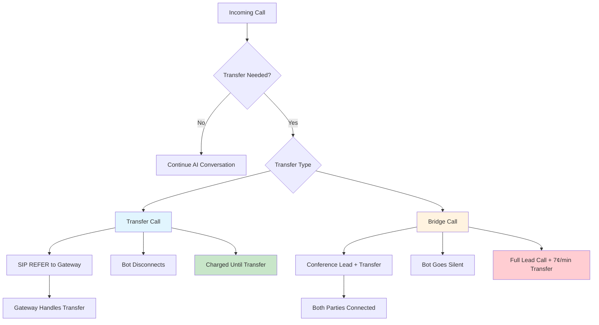

# Advanced Settings

<Info>
  **What you'll learn:** Advanced configuration options for language processing, speech recognition, post-call webhooks, transfer settings, and system parameters to optimize your AI calling campaigns.
</Info>

## Language Configuration

### Language Selection

Choose the language for your AI conversations from the available options to ensure optimal speech recognition and response generation.

<Warning>
  **Critical:** Incorrect language and ASR combinations will cause call triggering to fail with the error: "Please choose proper language code"
</Warning>

#### **Available Languages**

Select from these supported languages in your campaign settings:

| Language | Variants Available | Best ASR Match | Use Cases |
|----------|-------------------|----------------|-----------|
| **English** | US, UK, India, Australia | Alpha Echo, Google ASR | Global business, customer service |
| **Hindi** | India | Alpha Echo, Nova Echo | Indian market campaigns |
| **German** | Standard | All ASR providers | German-speaking markets |
| **Spanish** | Standard | All ASR providers | Spanish-speaking regions |
| **Italian** | Standard | All ASR providers | Italian market campaigns |

#### **Language Selection Guidelines**

<Tabs>
  <Tab title="English Variants">
    **Choose the Right English Variant:**
    - **English (US)** - American pronunciation, terminology
    - **English (UK)** - British pronunciation, terminology
    - **English (India)** - Indian accent optimization
    - **English (Australia)** - Australian accent optimization
    
    **Best for:** Matching your target audience's accent and terminology preferences
  </Tab>
  
  <Tab title="Regional Languages">
    **Specialized Language Support:**
    - **Hindi** - Optimized for Indian market campaigns
    - **German** - European German standard
    - **Spanish** - International Spanish
    - **Italian** - Standard Italian
    
    **Best for:** Native language campaigns in specific regions
  </Tab>
</Tabs>

<Tip>
  **Selection Tip:** Choose the language variant that best matches your target audience's location and accent for optimal recognition accuracy.
</Tip>

---

## ASR (Automatic Speech Recognition) Providers

Choose the speech recognition system that best fits your language and accuracy requirements.

### Available ASR Options

<Tabs>
  <Tab title="Alpha Echo (Recommended)">
    **Vodex Custom Trained Deepgram Model**
    
    **Features:**
    - Custom trained on conversation data
    - Supports all Deepgram languages
    - Enhanced accuracy for calling scenarios
    - Optimized for real-time processing
    
    **Advantages:**
    - **Better accuracy** than standard models
    - **Conversation-optimized** training
    - **Low latency** for real-time calls
    - **Multi-language support**
    
    **Best for:** Most calling scenarios, customer service, sales calls
  </Tab>
  
  <Tab title="Google ASR">
    **Google Cloud Speech-to-Text**
    
    **Features:**
    - Enterprise-grade reliability
    - Extensive language support
    - Real-time streaming recognition
    - Automatic punctuation and formatting
    
    **Advantages:**
    - **High accuracy** across languages
    - **Robust performance** in noisy environments
    - **Global language coverage**
    - **Enterprise reliability**
    
    **Best for:** Multi-language campaigns, enterprise applications
  </Tab>
  
  <Tab title="OpenAI Whisper">
    **OpenAI Whisper ASR**
    
    **Features:**
    - State-of-the-art accuracy
    - Multilingual capabilities
    - Robust to accents and noise
    - Open-source foundation
    
    **Advantages:**
    - **Exceptional accuracy**
    - **Accent tolerance**
    - **Noise resistance**
    - **Multilingual support**
    
    **Best for:** High-accuracy requirements, diverse accents, challenging audio
  </Tab>
  
  <Tab title="ElevenLabs Scribe">
    **ElevenLabs Speech Recognition**
    
    **Features:**
    - Optimized for voice synthesis integration
    - High-quality transcription
    - Real-time processing
    - Voice-optimized accuracy
    
    **Advantages:**
    - **Voice integration** with ElevenLabs TTS
    - **Optimized pipeline** for voice applications
    - **High quality** transcription
    
    **Best for:** ElevenLabs voice integration, voice-focused applications
  </Tab>
  
  <Tab title="Azure Speech">
    **Microsoft Azure Speech Services**
    
    **Features:**
    - Enterprise-grade security
    - Global deployment options
    - Custom model training
    - Integration with Microsoft ecosystem
    
    **Advantages:**
    - **Enterprise security**
    - **Custom models** available
    - **Global infrastructure**
    - **Microsoft integration**
    
    **Best for:** Enterprise deployments, Microsoft ecosystem integration
  </Tab>
  
  <Tab title="Genesis Echo">
    **Vodex Fine-tuned Whisper**
    
    **Features:**
    - On-premises deployable
    - Fine-tuned for specific use cases
    - Enhanced privacy and security
    - Custom optimization available
    
    **Advantages:**
    - **On-premises deployment**
    - **Enhanced privacy**
    - **Custom fine-tuning**
    - **Specialized optimization**
    
    **Best for:** Privacy-sensitive applications, on-premises requirements
  </Tab>
  
  <Tab title="Nova Echo">
    **Arabic-Specialized Model**
    
    **Features:**
    - Fine-tuned specifically for Arabic
    - Optimized for Gulf countries
    - Regional dialect support
    - Cultural context awareness
    
    **Advantages:**
    - **Arabic specialization**
    - **Gulf region optimization**
    - **Dialect recognition**
    - **Cultural accuracy**
    
    **Best for:** Arabic-speaking markets, Gulf countries, regional campaigns
  </Tab>
</Tabs>

---

## System Parameters

### Temperature Setting

Control the creativity and randomness of AI responses.

| Temperature | Behavior | Best For | Example Use Cases |
|-------------|----------|----------|-------------------|
| **0.0 - 0.3** | Very consistent, predictable | Formal business, compliance | Legal notices, appointment confirmations |
| **0.4 - 0.6** | Balanced, professional | Customer service, support | Help desk, technical support |
| **0.7 - 0.9** | Creative, conversational | Sales, engagement | Sales calls, relationship building |
| **1.0+** | Highly creative, varied | Creative applications | Marketing, entertainment |

<Tip>
  **Recommended Setting:** Use 0.5-0.7 for most business applications to balance consistency with natural conversation flow.
</Tip>

---

## Transfer Configuration

### Transfer Gateway

Specify which gateway to use when transferring calls to human agents or other numbers.

<AccordionGroup>
  <Accordion title="Default Gateway">
    **Standard Transfer Routing**
    - Uses your primary configured gateway
    - Consistent with inbound call routing
    - Simplified configuration
    - Standard reliability and quality
  </Accordion>
  
  <Accordion title="Custom Gateway">
    **Specialized Transfer Routing**
    - Dedicated gateway for transfers
    - Optimized for specific transfer scenarios
    - Enhanced routing options
    - Custom quality parameters
  </Accordion>
  
  <Accordion title="Load Balancing">
    **Multiple Gateway Support**
    - Distribute transfers across gateways
    - Improved reliability and capacity
    - Geographic routing optimization
    - Failover capabilities
  </Accordion>
</AccordionGroup>

### Transfer Call ID Options

Configure the caller ID displayed when transferring calls:

| Option | Caller ID Displayed | Use Case |
|--------|-------------------|----------|
| **default** | Your outbound caller ID | Standard business transfers |
| **lead** | The original caller's number | Warm transfers, continuity |
| **Any Number or DID** | Specified phone number | Specialized routing, departments |

---

## Transfer Types

Choose the appropriate transfer method based on your technical requirements and cost considerations.



### Transfer Call (Recommended)

<Card title="SIP REFER Transfer" icon="phone-arrow-right">
  **How it works:**
  - Sends a SIP REFER command to the gateway/trunk
  - Bot disconnects after successful transfer
  - Gateway handles the actual call connection
  
  **Billing:**
  - Charged only until the transfer completes
  - No additional charges for transferred portion
  - Most cost-effective option
  
  **Requirements:**
  - Gateway/trunk must support SIP REFER
  - Proper SIP configuration required
</Card>

**Advantages:**
- ✅ **Cost-effective** - No charges after transfer
- ✅ **Clean handoff** - Bot completely disconnects
- ✅ **Gateway managed** - Reliable transfer handling
- ✅ **Scalable** - Minimal resource usage

**Best for:** Standard business transfers, cost-conscious deployments

### Bridge Call

<Card title="Conference Bridge Transfer" icon="users">
  **How it works:**
  - Creates a conference between lead and transfer destination
  - Bot remains connected but goes silent
  - All parties on the same call
  
  **Billing:**
  - Full charges for the original lead call
  - Additional 7¢/minute for the transferred call
  - Charges continue for entire call duration
  
  **Requirements:**
  - No special gateway requirements
  - Works with any SIP provider
</Card>

**Advantages:**
- ✅ **Universal compatibility** - Works with any gateway
- ✅ **Reliable connection** - No dependency on SIP REFER
- ✅ **Monitoring capability** - Bot can monitor the transfer
- ✅ **Fallback option** - When SIP REFER isn't supported

**Best for:** Gateways without SIP REFER support, monitoring requirements

### Choosing the Right Transfer Type

<Tabs>
  <Tab title="Use Transfer Call When">
    **Recommended Scenarios:**
    - Your gateway supports SIP REFER
    - Cost optimization is important
    - Clean call handoffs are required
    - High-volume transfer scenarios
    - Standard business operations
  </Tab>
  
  <Tab title="Use Bridge Call When">
    **Necessary Scenarios:**
    - Gateway doesn't support SIP REFER
    - Need to monitor transferred calls
    - Require guaranteed connectivity
    - Complex transfer scenarios
    - Fallback option needed
  </Tab>
</Tabs>

---

## Post-Call Insights Webhook

Configure automated post-call data delivery to your systems for analysis and integration.

### Webhook Configuration

Simply provide your webhook URL to receive detailed call information immediately after each call completes.

<Info>
  **Simple Setup:** Just enter your webhook URL - no authentication configuration needed. The webhook will receive unauthenticated POST requests with call data.
</Info>

<CodeGroup>
```text Webhook URL Setup
https://your-domain.com/api/call-insights
```

```json Example Webhook Payload
{
  "dbUrl": "Vodex_",
  "projectId": "68ad89e46ba60ab120b9aaed",
  "campaignRunId": "68ad8e79a5f47ab2fd36cca0",
  "call_uuid": "68adc5c4-2709-40e4-9f10-ea01d0731d",
  "callRecordingUrl": "https://storage.googleapis.com/botstream-recordings/68adc5c4-2709-40e4-9f10-ea01d0731d.mp3",
  "summary": "Sandeep called ANS Hospital to book an appointment for physiotherapy. The agent, Rana, helped him book an appointment with Mr. AA for tomorrow at 10:00 AM. Sandeep confirmed the details and said he had no further questions.",
  "questions": [
    {"key": "department", "value": "physiotherapy"},
    {"key": "appointment_time", "value": "2025-08-27t10:00:00"},
    {"key": "appointment", "value": true},
    {"key": "doctor", "value": "AA"}
  ],
  "mobileNo": "120523644",
  "callStatus": "Ended",
  "contactId": null,
  "email": "email@string.com",
  "transcript": [
    {
      "type": "input",
      "value": " hi",
      "created_date": "26-08-2025 16:09:36"
    },
    {
      "type": "response",
      "value": " \"Hello, thank you for calling Kims Hospital. I'm rana, how can I help you today?\"",
      "created_date": "26-08-2025 16:09:36"
    }
  ],
  "mandatory_params": {
    "FirstName": "Name",
    "LastName": "Name",
    "PhoneNum": "120523644",
    "firstName": "Name",
    "lastName": "Name",
    "phone": "1205236446,
    "time_zone": "+05:30",
    "today": ""
  },
  "duration": 106.5584888458252
}
```
</CodeGroup>

<Note>
  **Questions Field:** The `questions` array content will vary for each client as the data is pulled from your custom Insights configuration. However, the structure always remains the same: an array of objects with `key` and `value` properties.
</Note>

### Webhook Data Fields

<AccordionGroup>
  <Accordion title="Call Identification">
    **Unique Identifiers:**
    - `call_uuid` - Unique call identifier
    - `projectId` - Your project identifier
    - `campaignRunId` - Campaign run identifier
    - `dbUrl` - Database reference
  </Accordion>
  
  <Accordion title="Call Content">
    **Conversation Data:**
    - `summary` - AI-generated call summary
    - `transcript` - Complete conversation transcript
    - `questions` - Extracted key-value pairs
    - `callRecordingUrl` - Audio recording URL
  </Accordion>
  
  <Accordion title="Contact Information">
    **Participant Details:**
    - `mobileNo` - Contact phone number
    - `email` - Contact email address
    - `contactId` - Internal contact identifier
    - `mandatory_params` - Custom field values
  </Accordion>
  
  <Accordion title="Call Metrics">
    **Performance Data:**
    - `duration` - Call length in seconds
    - `callStatus` - Final call status
    - `created_date` - Timestamp for each interaction
  </Accordion>
</AccordionGroup>

### Webhook Best Practices

<Steps>
  <Step title="Endpoint Security">
    **Secure Your Webhook**
    - Use HTTPS endpoints only
    - Validate incoming requests
    - Rate limit webhook calls
    - Consider IP whitelisting if needed
  </Step>
  
  <Step title="Reliable Processing">
    **Handle Webhook Data**
    - Respond with HTTP 200 for successful processing
    - Implement retry logic for failures
    - Store data before processing
    - Handle duplicate deliveries gracefully
  </Step>
  
  <Step title="Data Integration">
    **Integrate with Your Systems**
    - Parse JSON payload correctly
    - Map fields to your database schema
    - Trigger automated workflows
    - Generate reports and analytics
  </Step>
</Steps>

---

## Configuration Best Practices

### Language and ASR Optimization

<Tip>
  **Performance Tip:** Always test language code and ASR combinations in a development environment before deploying to production campaigns.
</Tip>

| Scenario | Recommended ASR | Language Code | Notes |
|----------|----------------|---------------|-------|
| **English Business** | Alpha Echo | `en-US` | Best overall performance |
| **Multi-language** | Google ASR | Various | Broad language support |
| **High Accuracy** | OpenAI Whisper | Any supported | Maximum accuracy |
| **Arabic Markets** | Nova Echo | `ar-SA` | Specialized for Gulf region |
| **Privacy-sensitive** | Genesis Echo | Any supported | On-premises option |

### Transfer Configuration Guidelines

<Warning>
  **Important:** Always verify that your gateway supports SIP REFER before configuring Transfer Call mode. Use Bridge Call as a fallback option.
</Warning>

### Webhook Integration Tips

<AccordionGroup>
  <Accordion title="Development Testing">
    **Test Your Integration:**
    - Use webhook testing tools (ngrok, RequestBin)
    - Validate JSON parsing
    - Test error handling
    - Verify data mapping
  </Accordion>
  
  <Accordion title="Production Deployment">
    **Production Readiness:**
    - Implement proper logging
    - Set up monitoring and alerts
    - Configure backup endpoints
    - Document data flows
  </Accordion>
</AccordionGroup>

---

## Next Steps

After configuring advanced settings:

1. **Test language and ASR combinations** in development
2. **Configure transfer settings** based on your gateway capabilities
3. **Set up webhook endpoints** for post-call data integration
4. **Monitor performance** and adjust settings as needed
5. **Document your configuration** for team reference

<Check>
  **Advanced Configuration Complete?** These settings provide fine-grained control over your AI calling campaigns. Proper configuration ensures optimal performance, cost efficiency, and seamless integration with your existing systems.
</Check>

---

**Need basic configuration help?** Check out our [Call Settings Overview](/call-settings/overview) for fundamental setup guidance and voice configuration options.