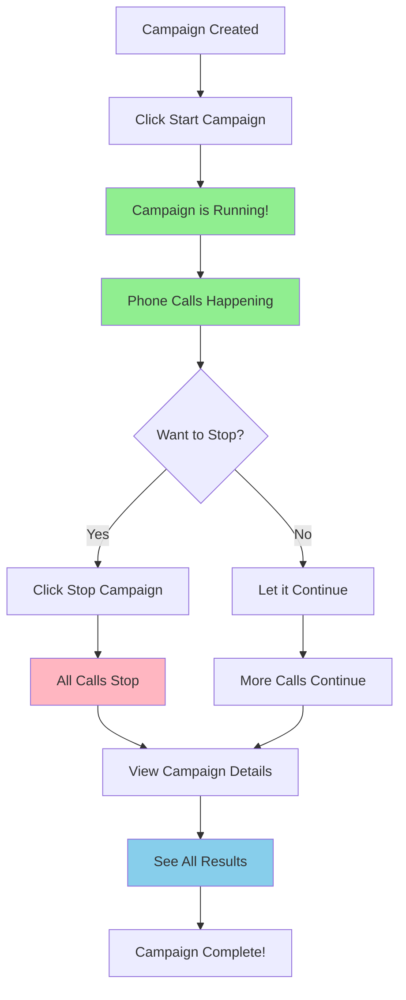

<Info>
  **What you'll learn:** How to control your running campaigns, stop calls when needed, and see all the details about what's happening with your calls.
</Info>

## What Is a Campaign Run?

Think of a **campaign run** like a **live TV show** - it's what happens when your campaign is actually making phone calls right now! 

- **Campaign Run** = Your campaign is actively calling people
- **Running Campaign** = Phone calls are happening right now
- **Campaign Run Details** = All the information about what happened during the calls

## How to Get to the Campaign Run Page

### **Step 1: Find the Redirect Icon**

1. **Look for a small arrow icon** (↗️) in your campaign page
2. **This icon is like a door** that takes you to different places
3. **Click on this redirect icon** when you want to see your running campaigns

<Warning>
  **Important:** The redirect icon looks like a small arrow pointing up and to the right. It's usually located near your campaign information.
</Warning>

### **Step 2: You're Now on the Campaign Run Page!**

After clicking the redirect icon, you'll see the **"Campaign Run"** page. This page shows you:

- **All your running campaigns** (campaigns that are making calls right now)
- **Campaign status** (is it working? is it paused?)
- **Action buttons** (things you can do to control your campaign)

## What You Can Do on the Campaign Run Page

### **🚫 Stop Your Campaign (Stop All Calls)**

Sometimes you need to **stop calling people immediately**. Here's how:

1. **Find your running campaign** in the list
2. **Look for the "Actions" section** (it's like a toolbox with buttons)
3. **Click on "Stop Campaign"** button
4. **All calls will stop immediately** - no more phone calls will be made

<Info>
  **Why stop a campaign?** Maybe you made a mistake, or you want to change something, or you've reached your goal. Stopping is like pressing a big red "STOP" button!
</Info>

### **👁️ View Campaign Details (See What Happened)**

Want to know **exactly what happened** with your calls? Here's how:

1. **Find your campaign** in the list
2. **Look for "View Details"** button
3. **Click on "View Details"**
4. **You'll go to the "Campaign Run Details" page**

## What You'll See on the Campaign Run Details Page

The **Campaign Run Details** page is like a **detailed report card** for your campaign. It shows you:

### **📞 Call Information**
- **How many calls were made** (total number)
- **How many calls were answered** (people who picked up)
- **How many calls were missed** (people who didn't answer)
- **How long each call lasted** (call duration)

### **🎯 Call Results**
- **What happened in each call** (did the person show interest?)
- **Call outcomes** (successful, not interested, wrong number, etc.)
- **Insights collected** (information gathered from the calls)

### **⏰ Timing Information**
- **When calls started** (start time)
- **When calls finished** (end time)
- **How long the campaign ran** (total duration)

## Simple Example: Understanding Campaign Run

Let's say you have a **"Pizza Delivery Campaign"**:

### **Before Running:**
- Campaign is created ✅
- AI Agent is ready ✅
- Audience list is loaded ✅
- Campaign is NOT running yet ❌

### **During Campaign Run:**
- Campaign is ACTIVE 🟢
- AI Agent is calling people 📞
- Phone calls are happening right now ⏰
- You can see live updates 📊

### **After Stopping:**
- Campaign is STOPPED 🔴
- No more calls are being made ❌
- You can see final results 📈
- You can start again if needed 🔄

## Visual Guide: Campaign Run Flow

Here's a simple picture showing how campaign run works:

## Common Questions About Campaign Run

### **❓ "Can I stop my campaign and start it again?"**
**Answer:** Yes! You can stop your campaign anytime and start it again later. It's like pausing a video and then playing it again.

### **❓ "What happens if I stop my campaign?"**
**Answer:** When you stop a campaign:
- **Calls that are already happening** will finish normally
- **New calls won't start** (like turning off a faucet)
- **All your progress is saved** (nothing is lost)

### **❓ "How do I know if my campaign is running?"**
**Answer:** Look for:
- **Green status indicator** (🟢 = running)
- **Live call counter** (numbers changing)
- **"Stop Campaign" button** (visible when running)

### **❓ "Can I see what's happening while calls are running?"**
**Answer:** Yes! You can:
- **Watch live updates** on the campaign run page
- **See call progress** in real-time
- **Monitor performance** as it happens

## Best Practices for Campaign Run

### **🎯 Before Starting Your Campaign**
- **Test with a small audience first** (like trying a recipe with a small portion)
- **Make sure your AI Agent is ready** (check your prompts and settings)
- **Have your audience list ready** (make sure phone numbers are correct)

### **🔄 While Your Campaign is Running**
- **Monitor the progress** (check in regularly to see how it's going)
- **Watch for any issues** (like calls not connecting or wrong numbers)
- **Be ready to stop if needed** (have a plan for emergencies)

### **📊 After Your Campaign Finishes**
- **Review the results** (see what worked and what didn't)
- **Check the insights** (what information did you collect?)
- **Plan improvements** (what can you do better next time?)

## What's Next?

Now that you understand how to control your running campaigns:

1. **Try starting a small campaign** to see how it works
2. **Practice stopping and starting** to get comfortable with the controls
3. **Explore the campaign details** to see all the information available
4. **Check out other campaign guides** to learn more advanced features

<Check>
  **Remember:** Campaign Run is like being the director of a live show. You can start it, stop it, and see exactly what's happening at any time!
</Check>

---

## Need Help?

If you have questions about controlling your campaigns:

- **Check the troubleshooting guide** for common issues
- **Review your campaign settings** to make sure everything is correct
- **Contact support** if you need additional help

<Card
  title="Ready to Control Your Campaigns?"
  icon="control"
  href="/campaign/guide"
  horizontal
>
  Go back to the main Campaign Guide to learn more about creating and managing campaigns.
</Card>
