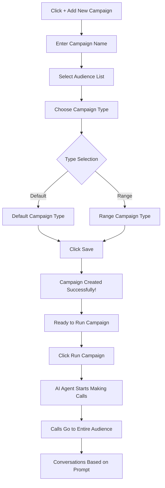

<Info>
  **What you'll learn:** How to create calling campaigns that connect your AI agents with your audience lists, and how to start making calls automatically.
</Info>

## What Is a Campaign?

Think of a **campaign** as a **calling project** - it's how you organize and start your AI calling activities. A campaign connects three important things:

1. **Your AI Agent** - The virtual caller that makes the phone calls
2. **Your Audience** - The list of people you want to call
3. **Your Calling Strategy** - How and when the calls will happen

## Why Do You Need Campaigns?

- **Organize your calling activities** - Keep different calling projects separate
- **Track results** - See how well each calling effort performs
- **Control the process** - Decide when to start and stop calling
- **Measure success** - Know how many calls were made and their outcomes

## How to Create Your First Campaign

### **Step 1: Start Creating a Campaign**

1. Go to the **Campaign section** in your dashboard
2. Click the **"+ Add New Campaign"** button
3. You'll see a form where you can set up your campaign

### **Step 2: Give Your Campaign a Name**

First, you need to identify your campaign:

| Field | What to Enter | Example |
|-------|---------------|---------|
| **Campaign Name** | A name to identify this calling project | "Q1 Customer Follow-up" |

<Warning>
  **Important:** Choose a clear, descriptive name for your campaign. This helps you track different calling efforts and measure their success.
</Warning>

### **Step 3: Select Your Audience**

This is where you choose who your AI agent will call:

1. **Click on the audience dropdown** menu
2. **Select the audience list** you created earlier
3. **This tells your campaign** which people to call

<Info>
  **Pro Tip:** Make sure you've already created your audience list before starting a campaign. If you haven't, check out our [Audience Guide](/audience/guide) first.
</Info>

### **Step 4: Choose Campaign Type**

You have **two options** for how your campaign will work:

#### **Option A: Default Campaign Type**
- **What it does:** Makes calls one after another automatically
- **When to use:** When you want to call everyone in your audience list
- **How it works:** The system calls each person in order until everyone has been contacted

#### **Option B: Range Campaign Type**
- **What it does:** Gives you control over how many calls to make
- **When to use:** When you want to test with a smaller group first
- **How it works:** You can set limits on the number of calls or specific time periods

<Check>
  **Recommendation:** Start with "Default" for your first campaign. It's simpler and will call everyone in your audience automatically.
</Check>

### **Step 5: Save Your Campaign**

1. **Review your settings** to make sure everything is correct
2. **Click "Save"** to create your campaign
3. **Your campaign is now ready** but not yet running

## Visual Guide: Creating a Campaign

Here's a simple flowchart showing the campaign creation process:

## What Happens After You Create a Campaign?

Once your campaign is saved:

1. **It appears in your campaign list** - You can see it in the dashboard
2. **It's ready to run** - But not yet making calls
3. **You can edit it** - Change settings if needed
4. **You can start it** - Begin making calls when you're ready

## How to Run Your Campaign

### **Starting Your Campaign:**

1. **Find your campaign** in the campaign list
2. **Click "Run Campaign"** button
3. **Confirm the action** if prompted
4. **Your campaign is now active!**

### **What Happens When You Run a Campaign:**

Once you click "Run Campaign":

- **AI Agent starts working** - Begins making phone calls automatically
- **Calls go to your entire audience** - Everyone in your selected list gets called
- **Conversations begin** - Each call follows the instructions in your AI agent's prompt
- **Progress tracking starts** - You can monitor how many calls are made and their results

<Info>
  **Important:** Make sure your AI agent is properly configured with a good prompt before running your campaign. The quality of your calls depends on how well your agent is set up.
</Info>

## Campaign Types Explained

### **Default Campaign Type:**

**What it does:**
- Calls everyone in your audience list automatically
- 5,000 limits on the number of calls
- Runs until all people have been contacted

**Best for:**
- Complete audience coverage under 5000
- When you want to reach everyone
- Simple, straightforward calling campaigns

**Example:**
- Audience: 10,000 customers
- Campaign: "Customer Satisfaction Survey"
- Result: The first 5,000 customers will receive calls initially, and once that group is completed, the remaining 5,000 customers will then receive calls.

### **Range Campaign Type:**

**What it does:**
- Gives you control over call volume and timing
- Can limit the number of calls per day
- Allows for more strategic calling patterns

**Best for:**
- Testing campaigns with smaller groups
- Controlling call volume during business hours
- A/B testing different approaches

**Example:**
- Audience: 10000 customers
- Campaign: "Test Campaign - 2000 Calls"
- Result: Only 2000 customers receive calls initially

## Campaign Management Tips

### **Before Running Your Campaign:**

1. **Test your AI agent** - Make sure it works correctly
2. **Verify your audience** - Check that contact information is correct
3. **Review your prompt** - Ensure your agent has good instructions
4. **Set appropriate timing** - Consider when people are most likely to answer

### **While Your Campaign is Running:**

1. **Monitor progress** - Watch how many calls are being made
2. **Check call quality** - Listen to recordings if available
3. **Track results** - See how people are responding
4. **Be ready to adjust** - Make changes if needed

### **After Your Campaign:**

1. **Review results** - See how many calls were successful
2. **Analyze performance** - Understand what worked and what didn't
3. **Update your strategy** - Make improvements for next time
4. **Plan follow-ups** - Decide what to do with the results

## Common Questions About Campaigns

### **How Long Does a Campaign Take?**
- **Depends on audience size** - 100 people might take a few hours
- **Depends on call duration** - Longer conversations = fewer calls per hour
- **Depends on system capacity** - How many calls can happen simultaneously

### **Can I Stop a Campaign?**
- **Yes!** You can pause or stop campaigns anytime
- **Pause temporarily** - Stop calling but keep the campaign active
- **Stop completely** - End the campaign and don't make more calls

### **What Happens If Someone Doesn't Answer?**
- **Your AI agent handles it** - Follows the instructions in your prompt
- **May leave voicemail** - If you've configured voicemail messages
- **May try again later** - Depending on your campaign settings

### **Can I Run Multiple Campaigns at Once?**
- **Yes!** You can have several campaigns running simultaneously
- **Different audiences** - Target different groups of people
- **Different purposes** - Sales, customer service, surveys, etc.
- **Track separately** - Monitor each campaign's performance individually

## Best Practices for Successful Campaigns

### **1. Start Small**
- **Test with small audiences** first (10-20 people)
- **Verify everything works** before scaling up
- **Learn from early results** and make adjustments

### **2. Use Clear Naming**
- **Be specific:** "Q1 Sales Follow-up" instead of "Campaign 1"
- **Include purpose:** "Customer Satisfaction Survey March 2024"
- **Add audience info:** "VIP Customer Retention Campaign"

### **3. Monitor Progress**
- **Check regularly** while campaigns are running
- **Look for patterns** in call results
- **Be ready to adjust** if something isn't working

### **4. Learn and Improve**
- **Review results** after each campaign
- **Identify what worked** and what didn't
- **Make changes** to improve future campaigns

## What Happens When Calls Are Made?

### **The Calling Process:**

1. **AI Agent selects** the next person from your audience
2. **Makes the phone call** using the phone number in your list
3. **Delivers greeting** based on your agent's configuration
4. **Follows the prompt** - Has conversations according to your instructions
5. **Handles responses** - Adapts to what the person says
6. **Ends call appropriately** - Uses tags or natural conversation flow
7. **Moves to next person** - Continues with the audience list

### **Call Outcomes:**

- **Successful conversations** - Person answered and talked to your agent
- **Voicemail messages** - Left appropriate messages when no one answered
- **No answers** - Calls that didn't connect
- **Busy signals** - Lines that were occupied

## Next Steps

Now that you understand how to create campaigns:

1. **Go to the Campaign section** and click "+ Add New Campaign"
2. **Give your campaign a clear name** for easy identification
3. **Select the audience** you want to call
4. **Choose campaign type** (start with Default)
5. **Save your campaign** and review the settings
6. **Click "Run Campaign"** when you're ready to start calling

<Check>
  **Ready to launch your calling campaign?** Follow these steps to create professional, effective campaigns that will help your AI agents reach your audience and achieve your calling goals.
</Check>

---

**Need help with audiences?** Check out our [Audience Guide](/audience/guide) to learn how to create the contact lists your campaigns will use.

**Want to learn about AI agents?** Visit our [Agents Overview](/agents/overview) to understand how to create the virtual callers that will make your campaign calls.
