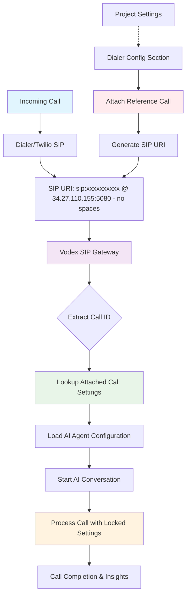
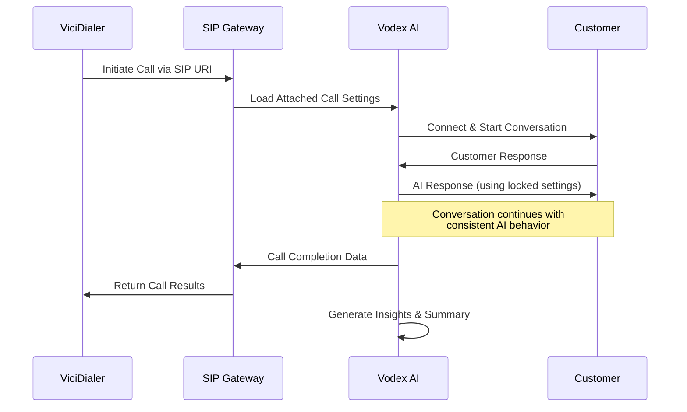

<Info>
  **Enterprise & Invite Only:** Inbound calling capabilities are available for Enterprise customers and by special invitation. Contact support for access to these advanced features.
</Info>

Vodex supports sophisticated inbound calling through SIP integration, enabling seamless integration with ViciDialer and other telephony systems. This powerful feature allows you to handle incoming calls with the same AI intelligence used for outbound campaigns.

---

## 🔄 How Inbound Integration Works

### System Architecture



### Dual Functionality

<Tabs>
  <Tab title="Inbound Calls">
    **True Inbound Handling**
    - Receive calls from customers calling your business
    - Handle customer service inquiries automatically
    - Process appointment requests and information calls
    - Manage support tickets and follow-ups
  </Tab>
  
  <Tab title="ViciDialer Integration">
    **Outbound via ViciDialer**
    - Use ViciDialer for predictive dialing
    - Leverage Vodex AI for conversation handling
    - Combine dialer efficiency with AI intelligence
    - Scale outbound operations with automation
  </Tab>
</Tabs>

---

## ⚙️ Configuration Process

### Step 1: Create Reference Call

<Steps>
  <Step title="Set Up Outbound Call">
    **Create Template Call**
    - Create a new outbound call in your project
    - Configure all desired settings (AI model, voice, prompts, etc.)
    - Set up custom fields and insights as needed
    - Test the call to ensure everything works correctly
  </Step>
  
  <Step title="Access Dialer Config">
    **Enable Dialer Configuration**
    - Navigate to your project settings
    - Look for "Dialer Config" section
    - **Note:** This section is enabled on request only
    - Contact support if you don't see this option
  </Step>
  
  <Step title="Attach Reference Call">
    **Link Call to Inbound**
    - In Dialer Config section, select your test call
    - Click "Attach Call" to link it to inbound routing
    - System will generate a unique SIP URI
    - Save the configuration
  </Step>
  
  <Step title="Get SIP URI">
    **Retrieve Connection Details**
    - System displays SIP URI: `sip:xxxxxxxxxx@34.27.110.155:5080`
    - Copy this URI for your dialer/Twilio configuration
    - The `xxxxxxxxxx` is your unique call identifier
  </Step>
</Steps>

### Step 2: Configure Your Dialer

<AccordionGroup>
  <Accordion title="🔧 Twilio SIP Configuration">
    **Twilio SIP Trunk Setup**
    
    **Origination URI:**
    ```
    sip:xxxxxxxxxx@34.27.110.155:5080
    ```
    
    **Configuration Steps:**
    1. Login to your Twilio Console
    2. Navigate to Elastic SIP Trunking
    3. Create or edit your SIP Trunk
    4. Add the Vodex SIP URI to Origination settings
    5. Configure authentication if required
    
    <Note>
      **Whitelist Status:** All Twilio SIP Trunks are pre-whitelisted on Vodex servers for seamless connectivity.
    </Note>
  </Accordion>
  
  <Accordion title="📞 ViciDialer Setup">
    **ViciDialer Configuration**
    
    **Carrier Settings:**
    - **Carrier Name:** Vodex-AI
    - **Gateway:** `34.27.110.155:5080`
    - **Dialplan:** Custom with Vodex SIP URI
    - **Protocol:** SIP
    
    **Dial String Format:**
    ```
    SIP/xxxxxxxxxx@34.27.110.155:5080
    ```
    
    **Campaign Configuration:**
    - Set up your ViciDialer campaign normally
    - Use Vodex carrier for outbound routing
    - Configure lead lists and dialing parameters
    - Vodex AI handles the conversation once connected
  </Accordion>
  
  <Accordion title="🌐 Generic SIP Provider">
    **Other SIP Systems**
    
    **Universal Configuration:**
    - **SIP Server:** `34.27.110.155`
    - **Port:** `5080`
    - **Username:** `xxxxxxxxxx` (from your SIP URI)
    - **Protocol:** SIP/UDP or SIP/TCP
    
    **Dial Pattern:**
    ```
    sip:xxxxxxxxxx@34.27.110.155:5080
    ```
  </Accordion>
</AccordionGroup>

---

## 🔒 Call Attachment System

### Why Use Call Attachment?

<Warning>
  **Quality Protection:** The call attachment system acts as a locking mechanism to ensure inbound call quality remains consistent even when project settings are being modified.
</Warning>

#### The Problem Without Attachment

<Card title="Uncontrolled Inbound Issues" icon="exclamation-triangle">
  **Potential Problems:**
  - Inbound calls affected by real-time project changes
  - Inconsistent AI behavior during settings updates
  - Quality degradation during agent modifications
  - Unpredictable call outcomes during maintenance
</Card>

#### The Solution: Call Attachment

<Card title="Locked Configuration Benefits" icon="lock">
  **Stability Advantages:**
  - Inbound calls use frozen, tested settings
  - Project modifications don't affect active inbound routing
  - Consistent AI behavior for all incoming calls
  - Quality assurance through configuration locking
</Card>

### How Call Attachment Works

<Steps>
  <Step title="Configuration Snapshot">
    **Settings Capture**
    - When you attach a call, Vodex captures all settings
    - AI prompt, voice settings, model configuration
    - Custom fields, insights, and workflow rules
    - Complete configuration is "frozen" for inbound use
  </Step>
  
  <Step title="Isolated Operation">
    **Independent Processing**
    - Inbound calls operate independently from project changes
    - Live project modifications don't affect inbound routing
    - Attached call settings remain stable and consistent
    - Quality is maintained regardless of ongoing work
  </Step>
  
  <Step title="Update Process">
    **Changing Inbound Settings**
    - To modify inbound behavior, create a new outbound call
    - Configure the new call with desired changes
    - Test thoroughly before attaching
    - Replace the old attachment with the new call
  </Step>
</Steps>

---

## 🔄 Operational Workflow

### Inbound Call Processing

<AccordionGroup>
  <Accordion title="📥 Call Arrival">
    **Incoming Call Handling**
    1. Call arrives at Vodex SIP gateway
    2. System extracts unique identifier from SIP URI
    3. Looks up attached call configuration
    4. Loads frozen AI agent settings
    5. Initiates AI conversation with caller
  </Accordion>
  
  <Accordion title="🤖 AI Processing">
    **Conversation Management**
    - AI uses locked prompt and personality settings
    - Processes caller input using configured model
    - Applies custom fields and insights collection
    - Handles conversation flow according to attached settings
    - Maintains consistent behavior throughout call
  </Accordion>
  
  <Accordion title="📊 Data Collection">
    **Insights and Analytics**
    - Collects insights based on attached call configuration
    - Updates CRM systems if configured
    - Generates call summaries and transcripts
    - Triggers webhooks with call completion data
    - Maintains audit trail for quality assurance
  </Accordion>
</AccordionGroup>

### ViciDialer Integration Flow



---

## 🛠️ Management and Updates

### Updating Inbound Configuration

<Steps>
  <Step title="Create New Reference Call">
    **Prepare Updated Settings**
    - Create a new outbound call with desired changes
    - Update prompts, voice settings, or AI model
    - Configure new custom fields or insights
    - Test thoroughly with sample calls
  </Step>
  
  <Step title="Validate Configuration">
    **Quality Assurance**
    - Run multiple test calls to verify behavior
    - Check all conversation flows and edge cases
    - Validate insights collection and data accuracy
    - Ensure voice quality and response timing
  </Step>
  
  <Step title="Update Attachment">
    **Switch to New Configuration**
    - Access Dialer Config section in project
    - Detach current call configuration
    - Attach the new, tested call
    - Verify SIP URI remains the same (or update dialer if changed)
  </Step>
  
  <Step title="Monitor Performance">
    **Post-Update Monitoring**
    - Monitor first few inbound calls closely
    - Verify AI behavior matches expectations
    - Check insights data collection
    - Confirm integration stability
  </Step>
</Steps>

### Best Practices

<AccordionGroup>
  <Accordion title="🎯 Configuration Management">
    **Setup Best Practices**
    - Always test outbound calls thoroughly before attaching
    - Use descriptive names for reference calls
    - Document configuration changes and reasons
    - Maintain backup configurations for quick rollback
  </Accordion>
  
  <Accordion title="📊 Quality Assurance">
    **Monitoring Guidelines**
    - Monitor inbound call quality regularly
    - Review AI conversation transcripts
    - Track customer satisfaction metrics
    - Analyze insights data for accuracy
  </Accordion>
  
  <Accordion title="🔄 Update Strategy">
    **Change Management**
    - Schedule configuration updates during low-traffic periods
    - Prepare rollback plans before making changes
    - Test new configurations extensively
    - Communicate changes to relevant team members
  </Accordion>
</AccordionGroup>

---

## 📈 Use Cases and Benefits

### Inbound Customer Service

<Card title="Automated Customer Support" icon="headset">
  **24/7 Customer Service**
  - Handle customer inquiries automatically
  - Provide account information and status updates
  - Process service requests and appointments
  - Escalate complex issues to human agents
  
  **Benefits:**
  - Reduced wait times for customers
  - Consistent service quality
  - 24/7 availability
  - Cost-effective support scaling
</Card>

### ViciDialer Enhancement

<Card title="Predictive Dialing + AI" icon="phone-volume">
  **Enhanced Outbound Operations**
  - Combine ViciDialer's predictive algorithms with Vodex AI
  - Increase agent efficiency through automation
  - Maintain conversation quality at scale
  - Reduce training requirements for human agents
  
  **Benefits:**
  - Higher contact rates
  - Consistent conversation quality
  - Scalable operations
  - Improved conversion rates
</Card>

---

## 🚀 Getting Started

### Prerequisites

<Warning>
  **Access Requirements:** Inbound/ViciDialer integration requires Enterprise plan or special invitation. Contact [support@vodex.ai](mailto:support@vodex.ai) for access.
</Warning>

### Setup Checklist

<Steps>
  <Step title="Verify Access">
    **Confirm Eligibility**
    - [ ] Enterprise plan active or invitation received
    - [ ] Dialer Config section visible in project
    - [ ] SIP integration permissions enabled
  </Step>
  
  <Step title="Prepare Configuration">
    **Create Reference Call**
    - [ ] Outbound call created and tested
    - [ ] AI prompts optimized for inbound scenarios
    - [ ] Custom fields and insights configured
    - [ ] Voice and model settings finalized
  </Step>
  
  <Step title="Configure Integration">
    **Set Up SIP Routing**
    - [ ] Call attached in Dialer Config section
    - [ ] SIP URI generated and copied
    - [ ] Dialer/Twilio configured with Vodex SIP URI
    - [ ] Connection tested and verified
  </Step>
  
  <Step title="Go Live">
    **Launch Inbound Operations**
    - [ ] Monitor first inbound calls closely
    - [ ] Verify AI behavior and quality
    - [ ] Check data collection and insights
    - [ ] Document configuration for team reference
  </Step>
</Steps>

---

## 💡 Next Steps

After setting up inbound integration:

1. **Monitor Performance** - Track call quality and AI behavior
2. **Optimize Prompts** - Refine AI instructions based on inbound scenarios
3. **Scale Operations** - Expand to handle higher call volumes
4. **Integrate Analytics** - Connect insights data to your reporting systems
5. **Train Team** - Ensure team understands the locked configuration system

<Check>
  **Ready for inbound AI calling?** The Vodex inbound integration provides enterprise-grade capabilities for handling incoming calls with the same AI intelligence used in outbound campaigns.
</Check>

---

## 🔓 Advanced Features & Customizations

### Undocumented Capabilities

<Card title="Extended Feature Set" icon="magic-wand">
  **Beyond Standard Documentation**
  
  The Vodex inbound and ViciDialer integration includes many advanced features and customizations that go beyond what's covered in this documentation. These enterprise-grade capabilities are designed for specific use cases and complex implementations.
  
  **Examples of Advanced Features:**
  - Custom SIP routing and failover configurations
  - Advanced ViciDialer campaign integrations
  - Specialized telephony provider integrations
  - Custom data flow and CRM synchronization
  - Advanced call routing and distribution logic
  - Specialized compliance and recording features
</Card>

<Warning>
  **Unlock Advanced Capabilities:** Many powerful features and customizations are available but not documented here. These enterprise-level capabilities are configured on a case-by-case basis to meet specific business requirements.
</Warning>

### Get Access to Advanced Features

<Steps>
  <Step title="Contact Our Team">
    **Discuss Your Requirements**
    - Email [support@vodex.ai](mailto:support@vodex.ai)
    - Subject: "Advanced Inbound/ViciDialer Features"
    - Describe your specific use case and requirements
  </Step>
  
  <Step title="Custom Configuration">
    **Tailored Implementation**
    - Our team will assess your needs
    - Custom features will be configured for your account
    - Specialized documentation provided as needed
  </Step>
  
  <Step title="Ongoing Support">
    **Enterprise Support**
    - Dedicated support for advanced features
    - Custom training and documentation
    - Priority assistance for complex implementations
  </Step>
</Steps>

<Tip>
  **Enterprise Advantage:** Advanced inbound and ViciDialer features are part of our commitment to providing enterprise-grade solutions that can be tailored to your specific business needs and technical requirements.
</Tip>

---

**Need access to inbound features?** Contact our enterprise team at [support@vodex.ai](mailto:support@vodex.ai) with "Inbound Integration Access" in the subject line to discuss Enterprise plan options, special invitations, and unlock advanced undocumented features.