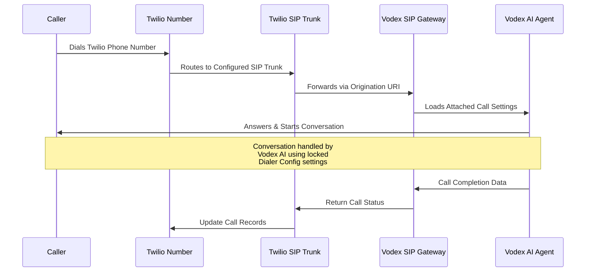

<Info>
  **Prerequisites:** This guide assumes you have already completed the Dialer Config setup in your Vodex project and obtained your SIP URI. If you haven't done this yet, please refer to the [Inbound Overview](/inbound/overview) first.
</Info>

Configure your Twilio SIP Trunk to route incoming calls directly to your Vodex AI agents. This setup ensures that any call coming to your Twilio phone number will be automatically answered and handled by your configured AI bot.

---

## 🎯 Configuration Overview

When you complete this setup:
- **Incoming calls** to your Twilio phone number → **Automatically answered by Vodex AI**
- **No human intervention** required for call handling
- **Consistent AI behavior** using your locked Dialer Config settings
- **Seamless integration** between Twilio and Vodex platforms

---

## ⚙️ Step-by-Step Twilio Configuration

### Step 1: Complete Dialer Config Setup

<Warning>
  **Required First:** You must complete the Dialer Config setup in your Vodex project before configuring Twilio. This generates the SIP URI needed for the configuration.
</Warning>

**Before proceeding, ensure you have:**
- ✅ Created and tested your reference call in Vodex
- ✅ Attached the call in Dialer Config section
- ✅ Obtained your SIP URI: `sip:xxxxxxxxxx@34.27.110.155:5080`
- ✅ Noted down the `xxxxxxxxxx` identifier from your SIP URI

### Step 2: Access Twilio SIP Trunking

<Steps>
  <Step title="Login to Twilio Console">
    **Navigate to SIP Trunking**
    1. Open your browser and go to [Twilio Console](https://console.twilio.com/us1/develop/sip-trunking/manage/trunks?frameUrl=/console/sip-trunking/trunks)
    2. Login with your Twilio account credentials
    3. Navigate to **Develop** → **Elastic SIP Trunking** → **Trunks**
  </Step>
  
  <Step title="Create New SIP Trunk">
    **Set Up Trunk**
    1. Click **"Create new SIP Trunk"** button
    2. Enter a descriptive name (e.g., "Vodex-AI-Inbound")
    3. Add any relevant description for future reference
    4. Click **"Create"** to proceed
  </Step>
</Steps>

### Step 3: Configure Origination Settings

<Steps>
  <Step title="Access Origination Section">
    **Navigate to Origination**
    1. In your newly created SIP Trunk, click on **"Origination"** tab
    2. This is where you'll configure how Twilio routes incoming calls
    3. Click **"Add Origination URI"** to create a new route
  </Step>
  
  <Step title="Configure Origination URI">
    **Enter Vodex SIP Details**
    
    **Origination URI:**
    ```
    sip:+xxxxxxxxxx@34.27.110.155:5080;transport=tcp
    ```
    
    **Configuration Parameters:**
    - **URI:** `sip:+xxxxxxxxxx@34.27.110.155:5080;transport=tcp`
    - **Priority:** `10`
    - **Weight:** `10`
    
    <Warning>
      **Important:** Replace `xxxxxxxxxx` with your actual SIP identifier from the Dialer Config setup. Include the `+` sign before your identifier.
    </Warning>
  </Step>
  
  <Step title="Save Configuration">
    **Finalize Setup**
    1. Double-check all parameters are correct
    2. Verify the SIP URI matches your Vodex configuration
    3. Click **"Save Configuration"** or **"Add"** to apply settings
    4. Confirm the origination URI appears in your trunk configuration
  </Step>
</Steps>

---

## 🔧 Configuration Details

### SIP URI Format Breakdown

```
sip:+xxxxxxxxxx@34.27.110.155:5080;transport=tcp
```

| Component | Value | Description |
|-----------|-------|-------------|
| **Protocol** | `sip:` | SIP protocol identifier |
| **User** | `+xxxxxxxxxx` | Your unique Vodex SIP identifier (with + prefix) |
| **Host** | `34.27.110.155` | Vodex SIP gateway IP address |
| **Port** | `5080` | SIP communication port |
| **Transport** | `tcp` | Transport protocol for reliable delivery |

### Priority and Weight Settings

| Parameter | Recommended Value | Purpose |
|-----------|------------------|---------|
| **Priority** | `10` | Lower numbers = higher priority |
| **Weight** | `10` | Load balancing weight (higher = more traffic) |

<Info>
  **Settings Explanation:** Priority 10 and Weight 10 are standard values that work well for most configurations. Priority determines route preference (lower numbers get higher priority), while weight handles load distribution among routes with the same priority.
</Info>

---

## 📞 Linking Phone Numbers

### Step 4: Connect Phone Number to SIP Trunk

<Steps>
  <Step title="Navigate to Phone Numbers">
    **Access Phone Number Management**
    1. In Twilio Console, go to **Phone Numbers** → **Manage** → **Active Numbers**
    2. Find the phone number you want to connect to Vodex AI
    3. Click on the phone number to edit its configuration
  </Step>
  
  <Step title="Configure Voice Settings">
    **Set Up Call Routing**
    1. In the phone number configuration, find **"Voice & Fax"** section
    2. Set **"Configure with"** to **"SIP Trunk"**
    3. Select your newly created Vodex SIP Trunk from the dropdown
    4. Save the configuration
  </Step>
  
  <Step title="Test Configuration">
    **Verify Setup**
    1. Call your Twilio phone number from any phone
    2. The call should be automatically answered by your Vodex AI agent
    3. Verify the AI responds according to your Dialer Config settings
    4. Check call quality and conversation flow
  </Step>
</Steps>

---

## 🔄 How It Works

### Call Flow Process



### What Happens During a Call

<AccordionGroup>
  <Accordion title="📥 Call Arrival">
    **Incoming Call Processing**
    1. Customer dials your Twilio phone number
    2. Twilio receives the call and checks configuration
    3. Call is routed to your configured SIP Trunk
    4. SIP Trunk forwards call to Vodex via Origination URI
  </Accordion>
  
  <Accordion title="🤖 AI Activation">
    **Vodex AI Engagement**
    1. Vodex SIP Gateway receives the call
    2. System extracts your unique identifier from SIP URI
    3. Looks up your attached Dialer Config settings
    4. Loads the frozen AI agent configuration
    5. AI answers the call and begins conversation
  </Accordion>
  
  <Accordion title="💬 Conversation Management">
    **Call Handling**
    1. AI uses your locked prompt and personality settings
    2. Processes customer input using configured AI model
    3. Applies custom fields and insights collection
    4. Maintains consistent behavior throughout the call
    5. Generates insights and call summary upon completion
  </Accordion>
</AccordionGroup>

---

## ✅ Verification and Testing

### Testing Your Setup

<Steps>
  <Step title="Initial Test Call">
    **Basic Functionality Check**
    1. Call your Twilio phone number from any device
    2. Verify the call is answered automatically
    3. Confirm the AI agent responds appropriately
    4. Test basic conversation flow
  </Step>
  
  <Step title="Quality Assessment">
    **Detailed Testing**
    1. Test different conversation scenarios
    2. Verify custom fields are being collected
    3. Check insights generation in your Vodex dashboard
    4. Assess call quality and response timing
  </Step>
  
  <Step title="Integration Validation">
    **End-to-End Verification**
    1. Confirm calls appear in your Vodex project
    2. Review transcripts and conversation data
    3. Verify any webhook integrations are working
    4. Test multiple concurrent calls if needed
  </Step>
</Steps>

### Troubleshooting Common Issues

<AccordionGroup>
  <Accordion title="🚫 Call Not Connecting">
    **Connection Issues**
    
    **Possible Causes:**
    - Incorrect SIP URI in Twilio configuration
    - Missing or wrong Vodex SIP identifier
    - Twilio trunk not properly linked to phone number
    
    **Solutions:**
    1. Double-check your SIP URI format and identifier
    2. Verify the origination URI is saved correctly
    3. Confirm phone number is linked to the correct SIP trunk
    4. Check Twilio console for error logs
  </Accordion>
  
  <Accordion title="📞 AI Not Responding">
    **Response Issues**
    
    **Possible Causes:**
    - Dialer Config not properly set up in Vodex
    - Reference call not attached or configured incorrectly
    - SIP identifier mismatch between Twilio and Vodex
    
    **Solutions:**
    1. Verify your Dialer Config setup in Vodex project
    2. Ensure reference call is properly attached
    3. Check that SIP identifiers match exactly
    4. Test the reference call directly in Vodex
  </Accordion>
  
  <Accordion title="🔊 Audio Quality Issues">
    **Call Quality Problems**
    
    **Possible Causes:**
    - Network connectivity issues
    - Incorrect transport protocol
    - SIP trunk configuration problems
    
    **Solutions:**
    1. Ensure transport=tcp is specified in URI
    2. Check network connectivity between Twilio and Vodex
    3. Verify SIP trunk configuration is complete
    4. Contact support if issues persist
  </Accordion>
</AccordionGroup>

---

## 🔧 Advanced Configuration

### Multiple Phone Numbers

<Card title="Scaling Your Setup" icon="phone">
  **Connecting Multiple Numbers**
  
  You can connect multiple Twilio phone numbers to the same Vodex AI configuration:
  
  1. **Same SIP Trunk:** Link multiple phone numbers to your existing SIP trunk
  2. **Same AI Agent:** All numbers will use the same attached Dialer Config
  3. **Consistent Experience:** Customers get the same AI interaction regardless of which number they call
  4. **Centralized Management:** Manage all inbound calls from one Vodex configuration
</Card>

### Different AI Agents per Number

<Card title="Customized Experiences" icon="users">
  **Multiple Configurations**
  
  For different AI behaviors per phone number:
  
  1. **Create separate SIP Trunks** in Twilio for each configuration
  2. **Set up different Dialer Configs** in Vodex with unique SIP URIs
  3. **Link each phone number** to its corresponding SIP trunk
  4. **Different AI experiences** for different business lines or purposes
</Card>

---

## 📋 Configuration Checklist

### Pre-Configuration
- [ ] Vodex Dialer Config completed
- [ ] SIP URI obtained from Vodex (`sip:xxxxxxxxxx@34.27.110.155:5080`)
- [ ] Twilio account with SIP Trunking enabled
- [ ] Phone number purchased and active in Twilio

### Twilio Configuration
- [ ] SIP Trunk created with descriptive name
- [ ] Origination URI configured: `sip:+xxxxxxxxxx@34.27.110.155:5080;transport=tcp`
- [ ] Priority set to `10`
- [ ] Weight set to `10`
- [ ] Configuration saved successfully

### Phone Number Linking
- [ ] Phone number configured to use SIP Trunk
- [ ] Voice settings updated to route through trunk
- [ ] Configuration saved and active

### Testing and Validation
- [ ] Test call completed successfully
- [ ] AI agent responds appropriately
- [ ] Call quality is acceptable
- [ ] Insights and data collection working
- [ ] Integration verified end-to-end

---

## 💡 Best Practices

### Configuration Management
- **Document your setup** - Keep records of SIP URIs and configuration details
- **Use descriptive names** - Name your SIP trunks clearly for easy identification
- **Test thoroughly** - Always test after making any configuration changes
- **Monitor performance** - Regularly check call quality and AI performance

### Security Considerations
- **Protect SIP URIs** - Don't share your SIP identifiers publicly
- **Monitor usage** - Watch for unexpected call patterns or volumes
- **Regular audits** - Periodically review your Twilio and Vodex configurations
- **Access control** - Limit who can modify your SIP trunk configurations

---

## 🚀 Next Steps

After completing your Twilio configuration:

1. **Monitor Call Performance** - Track call quality and AI behavior
2. **Optimize AI Prompts** - Refine your Dialer Config based on inbound scenarios
3. **Scale Your Operations** - Add more phone numbers as needed
4. **Integrate Analytics** - Connect call data to your reporting systems
5. **Train Your Team** - Ensure staff understand the inbound AI system

<Check>
  **Twilio Integration Complete!** Your phone number is now powered by Vodex AI. Incoming calls will be automatically answered and handled by your configured AI agent using the locked Dialer Config settings.
</Check>

---

**Need help with your Twilio configuration?** Contact our support team at [support@vodex.ai](mailto:support@vodex.ai) with "Twilio Inbound Setup" in the subject line for assistance with complex configurations or troubleshooting.
