Welcome to the comprehensive Vodex.ai documentation. This guide will help you set up, configure, and optimize your AI-powered voice calling campaigns for maximum effectiveness and ROI.

## What You'll Learn

This documentation covers everything you need to know about Vodex.ai:

<Columns cols={2}>
  <Card
    title="🤖 AI Agent Configuration"
    icon="robot"
  >
    Learn how to design effective prompts and configure AI agents for natural, human-like conversations.
  </Card>
  <Card
    title="⚙️ Call Settings & Models"
    icon="gear"
  >
    Configure AI models, voice options, transfer settings, and advanced call parameters for optimal performance.
  </Card>
  <Card
    title="✨ Insights & Analytics"
    icon="sparkles"
  >
    Extract valuable business insights from every call using AI-powered question analysis.
  </Card>
  <Card
    title="💬 Multi-Channel Messaging"
    icon="message"
  >
    Set up automated SMS, WhatsApp, and email messaging during or after calls.
  </Card>
</Columns>

---

## Vodex.ai Component Flow

Below is the complete workflow showing how all Vodex.ai components interact and depend on each other:

```mermaid
graph TD
    A[🚀 Start: Create Project] --> B[📁 Project Created]
    B --> C[🤖 Create AI Agent]
    B --> D[👥 Create Audience List]
    
    C --> E[✅ Agent Configured]
    D --> F[✅ Audience List Ready]
    
    E --> G[📋 Create Campaign]
    F --> G
    
    G --> H[🎯 Campaign Created]
    H --> I[✨ Create Insights]
    
    I --> J[📊 Insights Configured]
    J --> K[🚀 Launch Campaign]
    
    K --> L[📞 Calls Executed]
    L --> M[📈 Data Collected]
    M --> N[💡 Insights Generated]
    
    N --> P[🔄 Optimize & Iterate]
    P --> G
    
    style A fill:#e1f5fe
    style B fill:#f3e5f5
    style C fill:#e8f5e8
    style D fill:#fff3e0
    style E fill:#e8f5e8
    style F fill:#fff3e0
    style G fill:#fce4ec
    style H fill:#fce4ec
    style I fill:#e0f2f1
    style J fill:#e0f2f1
    style K fill:#e8eaf6
    style L fill:#e8eaf6
    style M fill:#f1f8e9
    style N fill:#f1f8e9
    style O fill:#fff8e1
    style P fill:#fce4ec
```

### Component Dependencies & Flow Explanation

**1. Project Foundation** 📁
- **Project Creation**: The starting point that contains all other components
- **Project Settings**: Configure basic parameters, API keys, and integrations

**2. Agent Configuration** 🤖
- **Agent Creation**: Design AI personality, prompts, and conversation flows
- **Agent Testing**: Validate responses and refine behavior
- **Agent Assignment**: Link agents to specific projects

**3. Audience Management** 👥
- **Audience List Creation**: Upload contacts, segment by criteria
- **Contact Validation**: Ensure phone numbers are valid and compliant
- **Audience Segmentation**: Group contacts by demographics, behavior, or custom fields

**4. Campaign Setup** 📋
- **Campaign Configuration**: Define objectives, timing, and call parameters
- **Agent Assignment**: Select which AI agent handles the campaign
- **Audience Selection**: Choose which audience list to target
- **Call Settings**: Configure voice, language, and transfer options

**5. Insights & Analytics** ✨
- **Insight Questions**: Define what data to extract from calls
- **Data Types**: Configure response formats and validation rules
- **Webhook Setup**: Enable real-time data delivery to your systems

**6. Execution & Optimization** 🚀
- **Campaign Launch**: Start calling campaigns with configured settings
- **Real-time Monitoring**: Track call progress and performance
- **Data Collection**: Gather insights and conversation data
- **Performance Analysis**: Review metrics and identify optimization opportunities

---

## Quick Start Guide

Get your first AI calling campaign up and running in minutes:

<Steps>
  <Step title="Set Up Your Project">
    **Create Your First Campaign**
    - Define your campaign objectives and target audience
    - Choose the appropriate AI model for your use case
    - Configure basic call settings and voice options
  </Step>
  
  <Step title="Design Your AI Agent">
    **Create Effective Prompts**
    - Write clear, specific instructions for your AI agent
    - Define conversation flows and handling scenarios
    - Test and refine your agent's responses
    
    👉 [Learn Prompt Design](/agents/prompt)
  </Step>
  
  <Step title="Configure Call Settings">
    **Optimize Performance**
    - Select the right AI model (GPT, Claude, or Vodex Spark)
    - Choose voice providers and configure caller ID
    - Set up transfer numbers and voicemail handling
    
    👉 [Configure Call Settings](/call-settings/overview)
  </Step>
  
  <Step title="Set Up Insights">
    **Track What Matters**
    - Create precise questions to extract business insights
    - Configure data types and naming conventions
    - Set up webhook integration for real-time data
    
    👉 [Create Insights](/insights/overview)
  </Step>
  
  <Step title="Launch & Optimize">
    **Go Live and Improve**
    - Start with test campaigns to validate setup
    - Monitor performance and call quality
    - Use insights data to optimize future campaigns
  </Step>
</Steps>

---

## Key Features Overview

### 🎯 **Campaign Management**
- **Project Organization**: Manage multiple campaigns and use cases
- **Audience Management**: Upload and segment your target contacts
- **Campaign Scheduling**: Control when and how calls are made
- **Performance Tracking**: Monitor success rates and outcomes

### 🤖 **AI Agent Capabilities**
- **Natural Conversations**: Human-like interactions with context awareness
- **Interruption Handling**: Smooth conversation flow even with interruptions
- **Voice Cloning**: Custom voice personalities for brand consistency
- **Multi-Language Support**: English variants, Hindi, German, Spanish, Italian

### 📊 **Analytics & Insights**
- **AI-Powered Analysis**: Automatic extraction of key information from calls
- **Custom Questions**: Define what insights matter to your business
- **Real-Time Data**: Webhook integration for immediate data access
- **Performance Metrics**: Track conversion rates, call duration, and outcomes

### 🔗 **Integrations**
- **CRM Systems**: HubSpot, Salesforce, SAP, and custom integrations
- **Communication**: Twilio, custom SIP, WhatsApp Business API
- **Automation**: Zapier, Make, custom webhooks, and API access
- **Messaging**: SMS, WhatsApp, and email during or after calls

---

## Documentation Structure

This documentation is organized into focused sections:

<AccordionGroup>
  <Accordion title="🏠 Overview & Getting Started">
    **Foundation Knowledge**
    - [What is Vodex.ai](/index) - Company overview and capabilities
    - [Getting Started](/introduction) - This guide to help you begin
    - [Quick Start](/quickstart) - Fast setup for immediate results
  </Accordion>
  
  <Accordion title="🤖 Agent Configuration">
    **AI Agent Setup**
    - [Prompt Design](/agents/prompt) - Create effective AI agent instructions
    - [Agent Tags](/agents/tags) - Organize and categorize your agents
  </Accordion>
  
  <Accordion title="⚙️ Call Settings">
    **Technical Configuration**
    - [Call Settings Overview](/call-settings/overview) - Basic configuration guide
    - [Advanced Settings](/call-settings/advanced-settings) - Language, ASR, webhooks
  </Accordion>
  
  <Accordion title="✨ Insights & Analytics">
    **Data & Intelligence**
    - [Insights Overview](/insights/overview) - AI-powered call analysis
    - Create custom questions to extract business value
  </Accordion>
  
  <Accordion title="💬 Messaging Integration">
    **Multi-Channel Communication**
    - [On-Call Messaging](/messaging/on-call-messaging) - SMS, WhatsApp, Email setup
  </Accordion>
  
  <Accordion title="🛠️ Support & Troubleshooting">
    **Help & Solutions**
    - [Common Issues](/troubleshooting/common-issues) - Solutions to frequent problems
    - [Best Practices](/custom-fields/best-practices) - Optimization guidelines
  </Accordion>
</AccordionGroup>

---

## Best Practices for Success

### 🎯 **Campaign Planning**
<Tip>
  **Start Small:** Begin with a focused use case and small audience to test and refine your approach before scaling up.
</Tip>

### 🤖 **Agent Design**
<Tip>
  **Be Specific:** Write detailed, specific prompts for your AI agents. The more precise your instructions, the better your results.
</Tip>

### 📊 **Insights Configuration**
<Tip>
  **Ask Precise Questions:** Create very specific insights questions. Don't just ask "if customer is interested" - ask exactly what constitutes interest.
</Tip>

### 🔧 **Technical Setup**
<Tip>
  **Test Everything:** Always test your configuration with sample calls before launching full campaigns.
</Tip>

---

## Industry Use Cases

Vodex.ai is optimized for various industries and scenarios:

<Tabs>
  <Tab title="Sales & Lead Generation">
    **Sales Automation**
    - Lead qualification and scoring
    - Product demonstrations and presentations
    - Follow-up calls and nurturing
    - Appointment scheduling with prospects
  </Tab>
  
  <Tab title="Customer Service">
    **Support Automation**
    - Customer inquiry handling
    - Account status updates
    - Service appointment scheduling
    - Satisfaction surveys and feedback
  </Tab>
  
  <Tab title="Collections & Finance">
    **Financial Communications**
    - Payment reminders and collections
    - Account verification and updates
    - Payment plan negotiations
    - Compliance-focused communications
  </Tab>
  
  <Tab title="Healthcare & Insurance">
    **Healthcare Communications**
    - Appointment reminders and confirmations
    - Insurance verification calls
    - Patient follow-up and care coordination
    - Prescription refill reminders
  </Tab>
</Tabs>

---

## Getting Help

### 📚 **Documentation Resources**
- Browse the complete documentation sections above
- Check [troubleshooting guides](/troubleshooting/common-issues) for common issues
- Review [best practices](/custom-fields/best-practices) for optimization tips

### 💬 **Support Channels**
- **Email Support:** [support@vodex.ai](mailto:support@vodex.ai)
- **Response Time:** Within 24 hours during business days
- **Include:** Clear description, screenshots, and steps you've tried

### 🚀 **Ready to Start?**

<Card
  title="Launch Your First Campaign"
  icon="rocket"
  href="/quickstart"
  horizontal
>
  Follow our step-by-step quickstart guide to create and launch your first AI calling campaign.
</Card>

---

## What's Next?

After reviewing this introduction:

1. **Explore the [Quickstart Guide](/quickstart)** for hands-on setup
2. **Learn [Prompt Design](/agents/prompt)** to create effective AI agents
3. **Configure [Call Settings](/call-settings/overview)** for optimal performance
4. **Set up [Insights](/insights/overview)** to track important metrics
5. **Review [Troubleshooting](/troubleshooting/common-issues)** for common solutions

<Check>
  **Ready to transform your voice operations?** This documentation provides everything you need to successfully implement and optimize AI-powered calling campaigns with Vodex.ai.
</Check>
